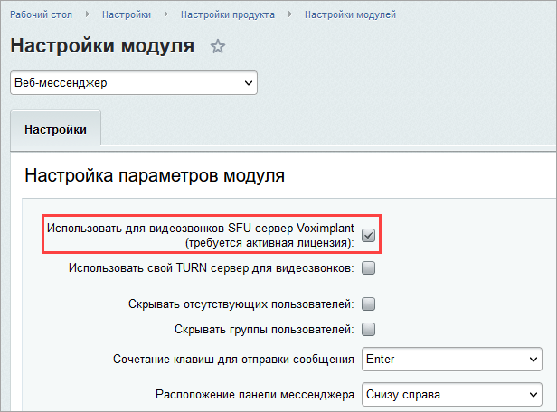

# Как включить звонки на 48 человек

**Навигация**
- [← Оглавление курса](index.md)
- [← Предыдущий: 4996 — Веб-мессенджер: настройки модуля](lesson_4996.md)
- [Следующий: 2928 — Создание шаблона веб-формы →](lesson_2928.md)

Официальная страница урока: https://dev.1c-bitrix.ru/learning/course/index.php?COURSE_ID=48&LESSON_ID=9185

*«Битрикс24» в коробке* позволяет включать звонки на аудиторию до 48 человек. Для этого вам необходимо иметь активную лицензию и выполнить две простые настройки:

**Важно!** Модуль **Веб-мессенджер** должен быть обновлен до версии 21.200.100 или выше.

1. Откройте страницу Настройки &gt; Настройки продукта &gt; Модули, в списке найдите модуль **Телефония** и нажмите **Установить**. Если модуль уже установлен, переходите к следующему шагу.
2. Откройте страницу Настройки &gt; Настройки продукта &gt; Настройки модулей &gt; Веб-мессенджер и отметьте  опцию **Использовать для видеозвонков SFU сервер Voximplant**:
  
  Сохраните настройки.

Теперь вы можете подключать к звонку до 48 человек.
