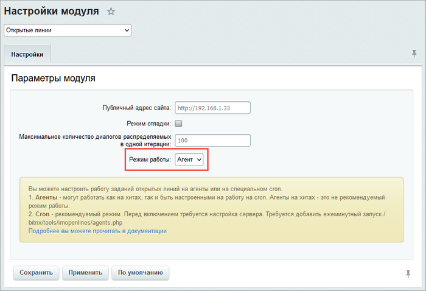

# Запуск заданий Открытых линий из cron

**Навигация**
- [← Оглавление курса](index.md)
- [← Предыдущий: 8405 — Настройки сервера и модуля портала](lesson_8405.md)
- [Следующий: 4867 — Планерки и собрания →](lesson_4867.md)

Официальная страница урока: https://dev.1c-bitrix.ru/learning/course/index.php?COURSE_ID=48&LESSON_ID=9219

### Задания и режимы работы

В уроке рассмотрим запуск следующих заданий **Открытых линий**:

- задание распределения диалогов по операторам;
- задание отправки почтовых сообщений;
- задание автоматического закрытия диалогов;
- задание автоматической отправки сообщения о недоступности операторов в диалог.

Любые другие задания выполняются по классической схеме агентов.

Существует три режима работы перечисленных выше заданий:

1. на агентах bitrix – запуск на хитах;
2. на агентах bitrix – запуск на cron;
3. на специальном cron Открытых линий.

Для первых двух необходимо, чтобы в настройках модуля **Открытые линии** было установлено **Режим работы: Агент**.

### 1. Режим на агентах bitrix – запуск на хитах

*Крайне не рекомендуемый режим.*

Лимит выполнения задания распределения – 5 секунд.

В этом случае сначала выполняются агенты (за это отвечает ядро продукта), затем код портала и потом уже отдается контент клиенту.

Даже при небольших объемах диалогов возможны значительные задержки распределения.

### 2. Режим на агентах bitrix – запуск на cron

*Допустимый, но также не рекомендуемый режим.*

Задания открытых линий конкурируют с другими агентами системы и при ошибках или большом количестве тяжелых агентов возможна как задержка распределения, так и его остановка.

Лимит времени выполнения задания распределения на одну итерацию – 60 секунд.

### 3. Режим на специальном cron Открытых линий

*Рекомендуемый режим!*

Лимит времени выполнения задания распределения диалогов – 180 секунд.

Для перевода заданий в этот режим работы необходимо:

- В настройках модуля **Открытые линии** необходимо **Режим работы** переключить в **Cron**:
  
- Настроить на сервере запуск по cron'у файла `/bitrix/tools/imopenlines/agents.php` раз в 60 секунд.

**Примечание.**

- Лимит времени распределения задания автоматической отправки сообщения о недоступности операторов в диалог равно лимиту времени задания распределения диалогов.
- Задания автоматического закрытия диалога и отправки почтовых сообщений выполняются по 100 элементов за раз.
