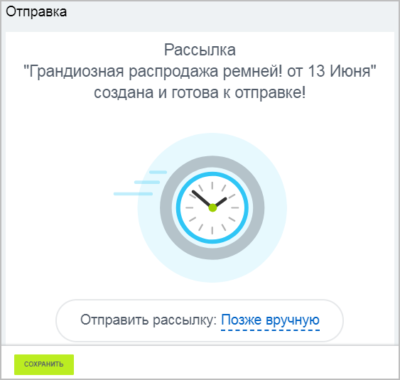

# Возможности E-mail маркетинга

**Навигация**
- [← Оглавление курса](index.md)
- [← Предыдущий: 20308 — Проверьте себя](lesson_20308.md)
- [Следующий: 11321 — Настройки модуля →](lesson_11321.md)

Официальная страница урока: https://dev.1c-bitrix.ru/learning/course/index.php?COURSE_ID=48&LESSON_ID=9257

|  | ### Основные возможности модуля: |
| --- | --- |

- Создание рассылок;
- Возможность подписываться к рассылкам или отписываться в один клик;
- Формирование рассылок по шаблонам;
- Отправка писем как вручную, так и с определенной периодичностью;
- Импорт адресов;
- Отправка писем как через Агент (на хитах), так и через Сron - поддержка в *BitrixVM*\*BitrixEnv* v7.2 (достаточно включить соответствующую опцию в меню);
- Поддержка вложений в письмах;
- Поддержка компонентов для почтовых шаблонов.

|  | ### Общая схема работы модуля Email-маркетинг |
| --- | --- |

- В основе рассылки лежит шаблон, который желательно подготовить заранее.
- Рассылка отправляется определенному набору адресатов - сегменту. Его тоже предпочтительней настроить заранее.
- Рассылку можно сделать периодической, установив в поле
  			Отправить рассылку
  
  		  значение **Каждый день**.

Если выпуск периодический, то перед отправкой набор адресов получателей обновляется.
Таким образом, если раз в неделю выполняется отправка новостей оформившим заказ на сайте, то новые покупатели с момента последней отправки также попадут в получатели.

Если выпуск отправляется разово и в определенное время, то список получателей также обновится перед отправкой.

Процесс создание сегментов, шаблонов и рассылок описан в курсе

			Продвижение сайта и Маркетинг

                    Поисковая оптимизация подразумевает постоянную работу, а не разовые акции по продвижению информационных ресурсов. На оценку поисковой системы влияют десятки различных факторов, начиная с имени домена и заканчивая качеством каналов связи.

[Подробнее ...](https://dev.1c-bitrix.ru/learning/course/index.php?COURSE_ID=139&CHAPTER_ID=011235)

		.

|  | #### Работа с модулем |
| --- | --- |

Администратор производит только [настройку модуля](lesson_11321.md) и кастомизацию. Всю [остальную работу](/learning/course/index.php?COURSE_ID=139&CHAPTER_ID=011235&LESSON_PATH=11427.2761.11235), как правило, выполняет контент-менеджер, причем выполняет её в

			административной части

                    **Административный раздел** - раздел системы, недоступный для просмотра обычным посетителям сайта. В нём производятся настройки сайта и системы для работы.

[Подробнее...](https://dev.1c-bitrix.ru/learning/course/index.php?COURSE_ID=34&CHAPTER_ID=04459&LESSON_PATH=3905.4455.4459)

		 сайта.

|  | #### Документация по теме: |
| --- | --- |

- [Email-маркетинг](https://dev.1c-bitrix.ru/user_help/marketing/sender/index.php)
