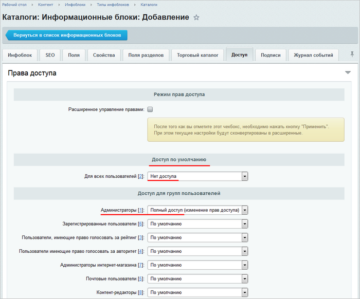
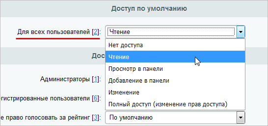
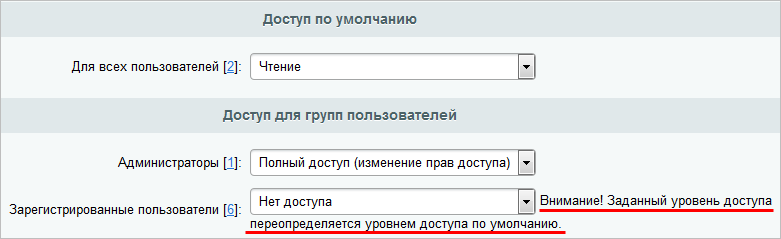

# Настройка доступа к инфоблокам

**Навигация**
- [← Оглавление курса](index.md)
- [← Предыдущий: 2022 — Дополнительная проверка прав доступа](lesson_2022.md)
- [Следующий: 8617 — Несколько примеров работы →](lesson_8617.md)

Официальная страница урока: https://dev.1c-bitrix.ru/learning/course/index.php?COURSE_ID=48&LESSON_ID=9411

### Видеоурок

### Настройка доступа

Регулирование доступа к инфоблоку — это ответственный этап его настройки. Неправильно заданные права могут привести к тому, что:

- информацию увидят те пользователи, которым видеть ее не положено
- пользователям не будет доступна полагающаяся информация.

Права доступа задаются для каждого инфоблока отдельно в форме его редактирования на закладке **Доступ**. По умолчанию к новому инфоблоку полный доступ имеет только группа пользователей **Администраторы**, а для всех остальных групп доступ закрыт:

### Настройка в простом режиме

Простой режим настройки прав доступа к инфоблоку — это режим, когда опция **Расширенное управление правами** отключена, а в секции **Доступ для групп пользователей** перечислены все имеющиеся у вас в системе

			группы пользователей.

Управление группами пользователей выполняется на странице **Группы пользователей**

(Настройки &gt; Пользователи &gt; Группы пользователей).

В системе существует две обязательные группы пользователей: **Все пользователи** и **Администраторы**.

Параметры данных групп пользователей могут быть изменены (название, описание, уровень прав

для группы **Все пользователи**), но сами группы не могут быть удалены из системы.

Для добавления новой группы служит кнопка **Добавить группу**, расположенная на контекстной панели.

Перейти к редактированию параметров группы можно либо кликнув левой кнопкой мыши по

соответствующей записи, либо с помощью пункта **Изменить** в контекстном меню.

[Подробнее](https://dev.1c-bitrix.ru/learning/course/index.php?COURSE_ID=35&CHAPTER_ID=02006&LESSON_PATH=3906.4503.2006)...

Предоставление группе некоторого права доступа заключается в его выборе из выпадающего списка:

- Так, контент-редакторам чаще всего предоставляется право
  			Изменение
                      
  		, поскольку именно они вносят информацию в инфоблок.
- Для всех пользователей обычно дают право
  			Чтение
                      
  		. Исключение составляют случаи закрытой информации, тогда всем пользователям оставляют **Нет доступа**, а **Чтение** назначают отдельной группе, например, группе подписчиков.

**Важно!** При настройке прав доступа помните, что пользователи любых групп обязательно принадлежат и к группе **Все пользователи**. Поэтому право доступа группы **Все пользователи** не должно быть «выше» прав доступа всех остальных групп. В противном случае вы получите

			ошибку

                    

		.

Когда вы хотите некоторой группе закрыть доступ, то следует закрыть доступ группе **Все пользователи**, требуемой группе проставить **По умолчанию**, а остальным необходимым группам проставить то право, которое было изначально у группы **Все пользователи**:

### Настройка в расширенном режиме

Расширенный режим позволяет настроить права доступа не только целиком ко всему инфоблоку, но и гибко задать права на
отдельные его разделы и элементы.

Для включения расширенного режима отметьте опцию **Расширенное управление правами** и обязательно нажмите кнопку **Применить**. Именно после применения настроек режим становится доступным, а все ваши имеющиеся настройки прав сохраняются и просто конвертируются в расширенные:

По ссылке

			Добавить

                    

		 вы можете выбрать не только группу пользователей, но и группу социальной сети, отдел структуры компании (Битрикс24) или непосредственно отдельных пользователей. Назначение прав выполняется обычным способом — выбором нужного

			уровня доступа из выпадающего списка

                    

		. Установленные права будут распространяться на все разделы и элементы до тех пор, пока в разделе (или элементе) вы не зададите отличное право доступа (смотрите пример в уроке

			Определение прав доступа динамических страниц

Информационные блоки позволяют задавать удобную иерархическую структуру, в которой права доступа наследуются по иерархии, то есть от Инфоблока к Разделу и, следом, к Элементу. Если администратор определил для контент-менеджера права доступа на информационный блок **Полный доступ**, то контент-менеджер тоже управляет доступом.

[Подробнее](https://dev.1c-bitrix.ru/learning/course/index.php?COURSE_ID=34&LESSON_ID=6909)...

		).

Также важно помнить, что если пользователь включен в несколько групп, ему будет присвоен максимальный уровень прав из всех этих групп. Это означает, что пользователь сможет выполнять действия и получать доступ к инфоблоку и его элементами на основе наивысших прав, предоставленных любой из его групп.

## Назначение прав доступа для отдела с подотделами в Битрикс24

В Битрикс24 можно назначать права доступа отделу вместе со всеми его подотделами.

Используйте эту возможность, если хотите дать одинаковые права всем отделам и подотделам без исключений. Назначить подотделу права ниже, чем у отдела с подотделами, не получится из-за правила максимальных прав. В таком случае настройте права для каждого отдела и подотдела раздельно.

### Заключение

Настройка доступа может выполняться в двух режимах:

- простом — права даются группам пользователей на весь инфоблок сразу.
- расширенном — права могут предоставляться как на весь инфоблок, так и на отдельные его разделы и элементы для различных групп и отдельных пользователей.
