# Итератор

**Навигация**
- [← Оглавление курса](index.md)
- [← Предыдущий: 3771 — Утверждение документа](lesson_3771.md)
- [Следующий: 3788 — Команда →](lesson_3788.md)

Официальная страница урока: https://dev.1c-bitrix.ru/learning/course/index.php?COURSE_ID=57&LESSON_ID=10481

Конструкция выполняет перебор значений во

			множественных

                    Включена опция **Множественный** в настройках. Например, для переменной шаблона:
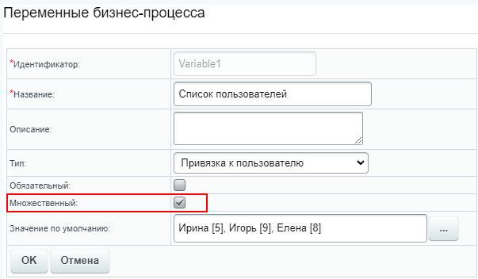

		 переменных. С помощью этой конструкции возможно создать цикл действий, каждая итерация которого выполнится с очередным значением множественной переменной (константы, параметра, поля документа).

### Параметры и структура конструкции

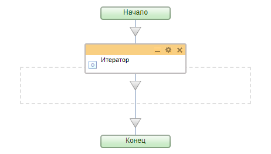

При добавлении конструкции Итератор в шаблон, появляется область выделенная серым цветом. Все действия, расположенные в этой области будут участвовать в цикле.

Итератор имеет один параметр **Источник**, в котором требуется выбрать

			источник значений

                    До версии модуля Бизнес-процессы **21.700.0** конструкция работала только с
переменными шаблона.
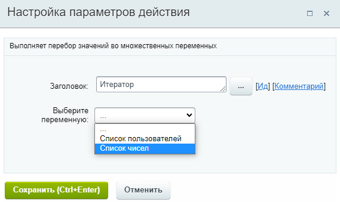

		 из списка. Источником значений может быть:

- Параметр/переменная/константа шаблона БП;
- Глобальная константа/переменная;
- Поле документа.

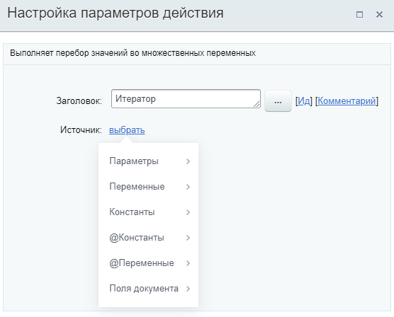

### Дополнительные результаты

В результате использования конструкции в форме **Вставка значения** станут доступны **Дополнительные результаты**, которые потребуются нам для использования в цикле:

- **Ключ**
- **Значение**

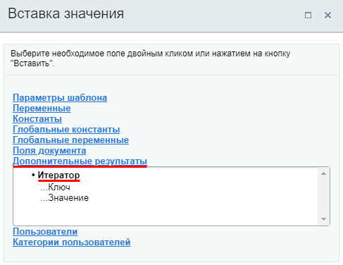

> Для того, чтобы каждый раз в цикле использовать очередное значение из источника, нужно использовать пункт
>
> 			Значение
>
>
>
>                     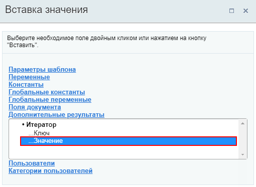
>
>
>
> 		 из Дополнительных результатов Итератора.

### Простой пример

Сначала подробно разберем работу итератора на очень простом примере:

- Пусть у нас есть множественная переменная типа **Целое число**, в которой задано 6 разных чисел: 4, 8, 15, 16, 23, 42.
  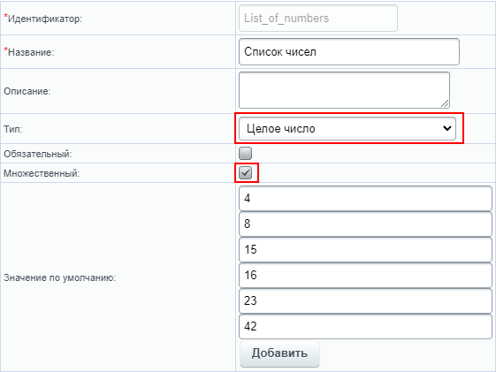
- Создаём шаблон бизнес-процесса. Используем конструкцию Итератор и действие
  			Сообщение соц. сети
                      Действие отправляет уведомление модуля социальной сети.
  [Подробнее](lesson_3804.md)...
  		 в теле итератора:
  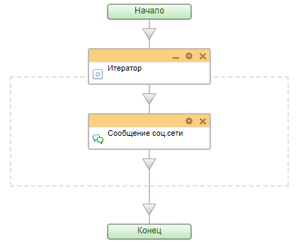
- В параметре Итератора укажем переменную со списком чисел, а в Сообщении соц. сети в качестве текста сообщения - дополнительный результат итератора
  			**Значение**
                      
  		:
  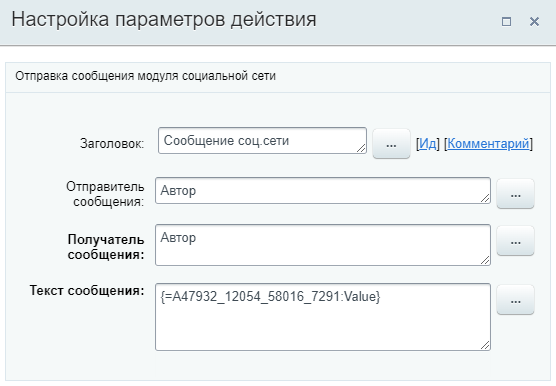

Сохраним шаблон и запустим его на выполнение. Результат - 6 уведомлений с числами из переменной:

Поясним как выполнялся процесс:

- Итератор взял первое значение из переменной. Это число **4**;
- Действие Сообщение соц.сети отработало с числом **4**. Первая итерация цикла завершилась;
- Итератор взял следующее значение из переменной - число **8**;
- Действие Сообщение соц.сети отработало с числом **8**. Вторая итерация цикла завершилась;
- И т.д. Процесс повторялся пока не было использовано последнее значение из переменной (число **42**).

Таким образом в бизнес-процессе совершено 6 итераций (т.к. в переменной 6 чисел) и в результате показано 6 уведомлений.

## Дополнительный результата итератора Ключ

Помимо Значения у итератора есть дополнительный результат **Ключ**. Ключ - это порядковый номер (отсчет начинается с нуля).

Использовать Ключ удобно, например, для автоматического проставления нумерации. Изменим текст в действии Сообщение соц. сети:

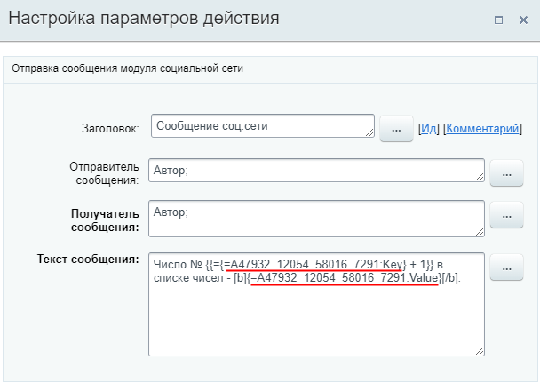

, где - `{=A47932_12054_58016_7291:Key}` это Ключ к которому мы прибавляем число 1, а `{=A47932_12054_58016_7291:Value}` - Значение итератора.

Результатом выполнения бизнес-процесса будет 6 таких уведомлений:

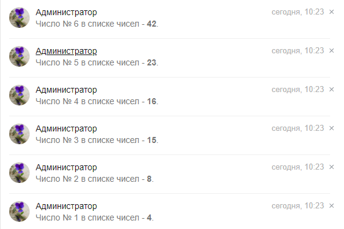

### Другие примеры

#### Создание задач для списка пользователей

Например, у вас имеется переменная с типом **Привязка к пользователю**, представляющая собой

			список сотрудников

                    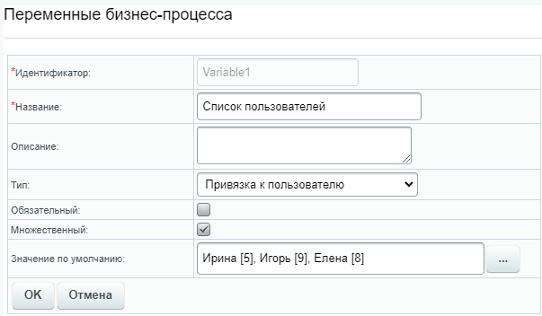

		. И вы хотите создать последовательно каждому из них задачу. Укажите в настройках Итератора переменную со списком, а в цикл добавьте действие

			Задача

                    Действие позволяет создать задачу.

[Подробнее](lesson_3805.md)...

		:

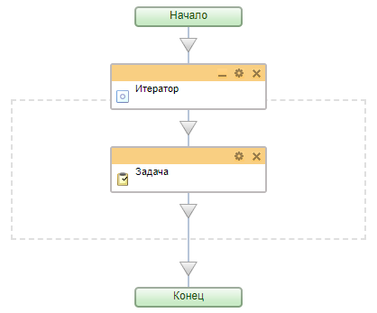

В качестве Ответственного укажем

			**Значение**

                    

		 из дополнительных результатов формы Вставка значения:

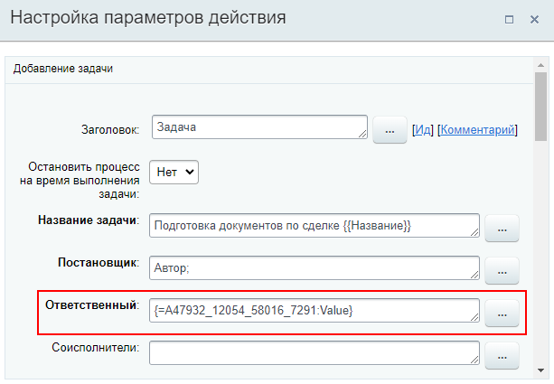

В результате запуска БП будет создано три задачи - по одной задаче для каждого пользователя из множественной переменной:

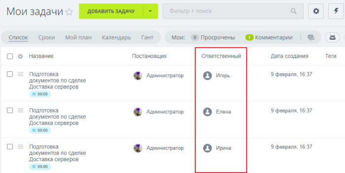

#### Чтение информации о всех товарных позициях сделки

Пример приведен в уроке [Информация о товарной позиции](lesson_23568.md#example).
