# Общие моменты

**Навигация**
- [← Оглавление курса](index.md)
- [← Предыдущий: 13026 — Практические задания](lesson_13026.md)
- [Следующий: 3780 — Блокировка документа →](lesson_3780.md)

Официальная страница урока: https://dev.1c-bitrix.ru/learning/course/index.php?COURSE_ID=57&LESSON_ID=12321

Последовательный бизнес-процесс

                    **Последовательный бизнес-процесс** – действия выполняются одно за другим от точки входа до точки выхода.

[Подробнее](lesson_3466.md)...

		 строится из набора действий. Каждое действие выполняет определенную функцию и имеет собственные параметры. Но у большинства из них есть общие моменты, о которых и расскажем в этом уроке.

### Общие параметры

Настройка параметров действия производится в соответствующей форме, которая вызывается с помощью двойного клика по тексту заголовка действия или с помощью кнопки  расположенной на нем.

## Пример открытой формы настройки параметров действия

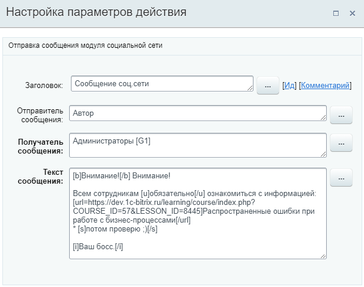

Выделим общие моменты, которые повторяются для всех или большинства действий:

- **Заголовок** – поле позволяет задать заголовок действия, который будет отображен в визуальном конструкторе. Для одинаковых действий следует задавать разные заголовки. Это
  			упростит
                      Например: **Дополнительные результаты** в форме **Вставка значения** сгруппированы именно по заголовкам действий. И чтобы не запутаться в них, лучше заранее назвать действия по-разному.
  		 дальнейшую работу с процессом.
  В заголовках действий допускается использование
  			смайликов (emoji)
                      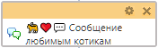
  		. С помощью них делайте любое действие более заметным в шаблоне БП.

**[Ид]** – ссылка, по нажатии на которую открывается уникальный

			идентификатор действия

                    В поле допустимо вводить только буквы латинского алфавита, цифры и символ подчеркивания.
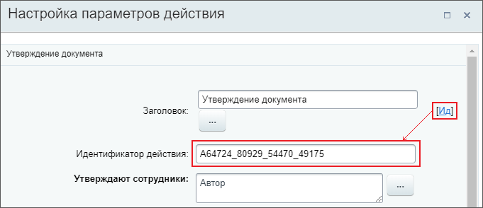

		 для просмотра и изменения. Например, его можно использовать при просмотре

			журнала

                    При разработке и использовании уже готовых процессов бывает необходимо узнать подробности выполнения того или иного процесса / действия. Для этого в системе предусмотрен журнал выполнения бизнес-процессов (лог).

[Подробнее](lesson_3837.md)...

		 выполнения бизнес-процесса в административной части сайта.

**[Комментарий]** – ссылка, по нажатии на которую открывается поле для ввода комментария. Здесь можно указать дополнительную поясняющую информацию к действию. Поле удобно использовать для быстрого ориентирования в шаблоне бизнес-процесса, т.к. эта информация сразу отображается при наведении на иконку со знаком **?** :

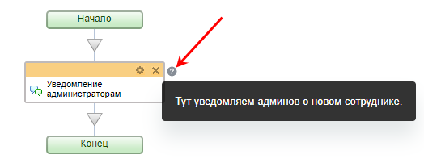

### Выключение действий

С версии модуля 23.300.0 появилась возможность выключать действия в шаблоне. Кнопка **Выключить / включить действие** находится в правом верхнем углу формы параметров и вызывается нажатием на три точки.

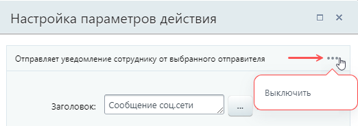

При выключении действие продолжает отображаться в схеме, но цвет его шапки меняется с оранжевого на серый. Удобно, что при этом сохраняются все настройки параметров, оно просто перестаёт действовать в БП. Таким образом вы можете временно отключать действия, например, для тестирования или доработки шаблона, а затем включать их в работу, когда это необходимо.

Все действия входящие в блок или конструкцию тоже становятся серыми и не будут выполняться. Включить действия внутри такого блока не получится, пока выключен «родитель».

Ветки в конструкциях тоже можно отключать. Например, так выглядит выключенная первая ветка внутри блока

			Условие

                    Конструкция позволяет направить бизнес-процесс по разным сценариям в зависимости от заданного типа условия.

[Подробнее](lesson_3789.md)...

		:

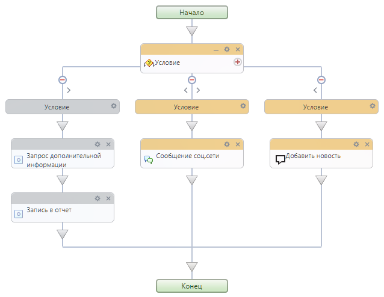

### Разметка BBCode

Поля c описанием задания или вводом текста сообщения позволяют использовать различные теги

			bb-code

                    **BBCode** – язык разметки, используемый для форматирования сообщений.

Подробнее на [Википедии](https://ru.wikipedia.org/wiki/BBCode)

		, например: `[img]`, `[url]`, `[b]`, `[i]`, `[s]`, `[u]` и т.д.

Пример использования из действия **Ознакомление с документом**:

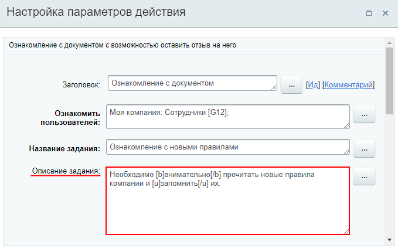

Другие примеры использования тегов bb-code есть в описании действий

			Сообщение соц.сети

                    Действие отправляет уведомление модуля социальной сети.

[Подробнее](lesson_3804.md)...

		 и

			Добавить комментарий

                    Действие добавляет комментарий в карточку документа CRM.
[Подробнее](lesson_20760.md)...

		.

### Подсказки

С версии **21.500.0** дизайнера бизнес-процессов в верхней части формы настройки параметров действия отображаются **Подсказки** о наличии битых ссылок на поля документа/переменные/константы. Например, такая подсказка появится, если неверно указан ID документа или указана несуществующая переменная:

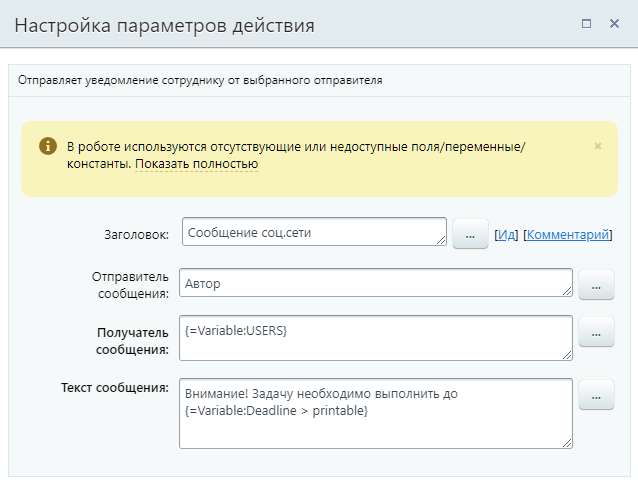

Ссылка «Показать полностью» отображается с версии **23.0.0** дизайнера БП. По нажатии на неё раскрывается список переменных/полей, которые не найдены системой:

### Поля выбора пользователей / групп

Пользователи или группы пользователей в соответствующих полях действий выбираются из списка или задаются вручную в поле. Вручную указывают тогда, когда сразу известен идентификатор пользователя или группы. В этом случае достаточно добавить в поле этот идентификатор:

- в квадратных скобках для пользователя, например `[1]`;
- без квадратных скобок для группы пользователей, например `1`.

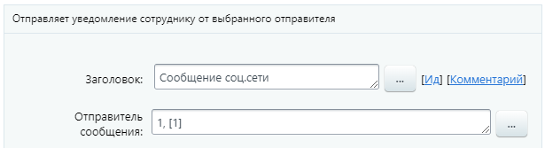

#### Переход на новую структуру

В Битрикс24 теперь используется модуль Управление персоналом (humanresources) для работы с подразделениями. Бизнес-процессы тоже переходят на новую структуру. С версии 25.200.0 поля с идентификаторами подразделений изменились.

1. Старые ID из инфоблока Оргструктура остались для совместимости, но их лучше не использовать. Пометили старые поля как `(устарело)`.
2. Добавили новые поля с актуальными ID из модуля humanresources. Рекомендуем заменить старые поля на новые.

Идентификаторы подразделений в старой и новой структуре могут не совпадать.

### Часовые пояса

Параметры действий типа «Дата/время» имеют возможность настройки часового пояса. Обычно это выбор из серверного и локального времени, либо выпадающий список с часовыми поясами.

Основные два типа:

- Серверное время: для облачных Битрикс24 в зоне RU — UTC+3:00 (Московское время), для коробочных версий — время сервера, на котором установлен продукт
- Локальное время / моё время: часовой пояс пользователя, запустившего процесс

При использовании бизнес-процессов для автоматического заполнения полей в продукте, помните: отображаемое время всегда подстраивается под часовой пояс пользователя. Например, вставка серверного времени [`{=System:Now}`](lesson_12383.md#system) в поле CRM типа «Дата/время» автоматически корректируется для каждого пользователя согласно его локальному времени. Тоже самое произойдет и в задаче, например, при выставлении крайнего срока через действие [Поставить задачу](lesson_3805.md).

### Ссылка на действие

Вы можете дать ссылку на шаблон бизнес-процесса с фокусом на конкретное действие. Это пригодится, когда вы хотите показать действие шаблона коллеге или сотруднику технической поддержки.

В дизайнере откройте форму редактирования действия, на которое требуется дать ссылку. В адресной строке браузере добавится идентификатор действия вида `#A89646_32580_52276_28755`.

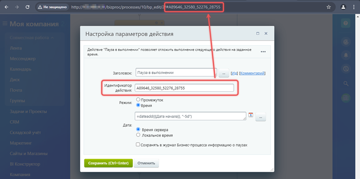

Скопируйте эту ссылку. Человек, который откроет ссылку, увидит шаблон бизнес-процесса с фокусом на действии. Действие ненадолго подсветится зеленой рамкой.

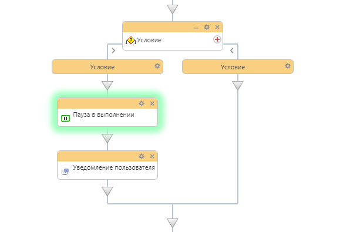

### Документация по теме

- [Создание собственных действий](/learning/course/index.php?COURSE_ID=57&CHAPTER_ID=04946) в главе для разработчиков.
