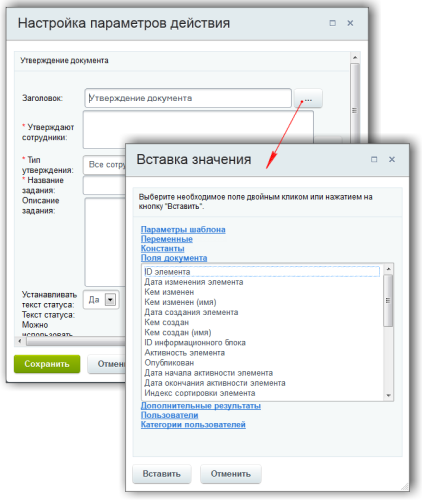
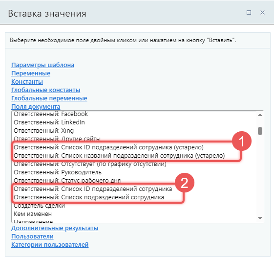
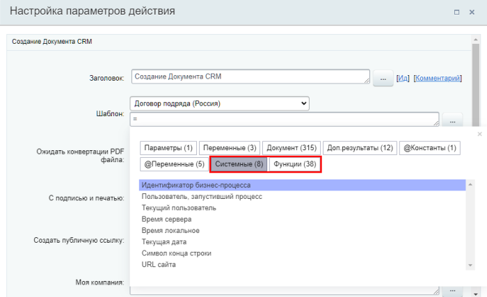

# Форма «Вставка значения»

**Навигация**
- [← Оглавление курса](index.md)
- [← Предыдущий: 13042 — Практические задания](lesson_13042.md)
- [Следующий: 4912 — Функции калькулятора выражений →](lesson_4912.md)

Официальная страница урока: https://dev.1c-bitrix.ru/learning/course/index.php?COURSE_ID=57&LESSON_ID=12383

Заполняем поля с помощью формы «Вставка значения»

### Форма

При работе с бизнес-процессом в параметрах действий, параметрах шаблона и настройках статуса есть возможность указывать как собственный текст (заданный вручную), так и использовать различные переменные значения (поля документа и прочие данные, которые могут меняться и поэтому не задаются вручную). Для подстановки таких переменных значений используется специальная форма **Вставка значения**.

**Примечание:** Для вставки одного и того же значения в разные действия шаблона не обязательно всегда пользоваться формой **Вставка значения**. Достаточно скопировать текст, вставленный с помощью этой формы, и использовать его дальше.

### Разделы формы

- Параметры шаблона — вставка параметров шаблона. Задаются для конкретного шаблона в форме, доступной по кнопке Параметры шаблона на контекстной панели визуального конструктора бизнес-процесса. Значение параметра — то, что введет пользователь в соответствующих полях при запуске бизнес-процесса.
- Переменные — вставка пользовательских переменных, которые могут изменяться по ходу выполнения бизнес-процесса. Пример: дополнительное числовое поле, заполняемое пользователем в процессе выполнения бизнес-процесса.
- Константы — вставка заранее заданных констант, которые остаются неизменными в процессе исполнения бизнес-процесса. Их значение задается в параметрах шаблона и пользователь, не имеющий доступа к изменению процессов, не может менять их значение.
- Глобальные константы — вставка значения глобальной константы, то есть неизменяемого значения которое доступно во всех процессах.
- Глобальные переменные — вставка значения глобальной переменной, то есть значения которое может быть изменено и доступно во всех процессах.
- Поля документа — вставка значения какого-либо поля документа, участвующего в бизнес-процессе. Например, Дата создания или Кем создан.
- Дополнительные результаты — вставка результатов выполнения некоторых действий. Не все действия предоставляют дополнительные результаты. В списке отображаются сразу все доступные результаты для всех действий, добавленных в текущий процесс, если они их поддерживают.
- Пользователи — вставка пользователя или группы пользователей, которые будут причастны к выполнению бизнес-процесса. Есть возможность выбрать несколько пользователей/групп пользователей. Для этого в качестве разделителя используется символ `;`.
  Список отображаемых пользователей зависит от настроек доступа к документу. Например, при создании шаблона БП для сущности CRM, в настройках
  			прав доступа в CRM
                      Права доступа в CRM необходимы для разделения зон ответственности при работе с клиентами.
  Подробнее на [helpdesk.bitrix24.ru](https://helpdesk.bitrix24.ru/open/6268091/).
  		 требуется сначала для группы или пользователя установить роль с правами не ниже «Чтение» к
  			элементам CRM
                      Например, если шаблон БП для сделок — то чтение к сделкам. Если БП для контактов — то чтение к контактам.
  		. Только после этого сотрудники появятся в форме.
  Сотрудники не будут отображены в форме, если права в настройках CRM выданы отделу, а не группе или пользователю.
- Категории пользователей — позволяет подробно указать пользователей, которые будут причастны к выполнению бизнес-процесса. В том числе можно выбрать Отдел или Группу соцсети.
  Возможна вставка как отдельных групп пользователей, так и целых отделов и
  			групп социальной сети
                      Группы (проекты) помогают сгруппировать все данные, задачи, файлы, сообщения, встречи в одном месте. Вы всегда сможете просмотреть, какие действия и задачи были выполнены в той или иной группе.
  [Подробнее](/learning/course/index.php?COURSE_ID=52&CHAPTER_ID=05011&LESSON_PATH=3922.5011)...
  		. Для этого в
  			настройках прав доступа к элементам и разделам процесса
                      Во вкладке **Управление правами доступа к элементам и разделам процесса** вы можете назначить права для работы с процессом как для целых отделов и групп, так и персонально для отдельных пользователей.
  [Подробнее](lesson_2767.md#access)...
  		 указываем группы, которые вы хотите чтобы
  			отображались в форме
                      Данная возможность пока недоступна в [бизнес процессах в универсальных списках](lesson_4516.md)
  		. Любая помещенная в эту вкладку группа вне зависимости от указанного уровня доступа будет отображаться в списке.

### Переход на новую структуру

В Битрикс24 теперь используется модуль Управление персоналом (humanresources) для работы с подразделениями. Бизнес-процессы тоже переходят на новую структуру. С версии 25.200.0 поля с идентификаторами подразделений изменились.

1. Старые ID из инфоблока Оргструктура остались для совместимости, но их лучше не использовать. Пометили старые поля как `(устарело)`.
2. Добавили новые поля с актуальными ID из модуля humanresources. Рекомендуем заменить старые поля на новые.

Идентификаторы подразделений в старой и новой структуре могут не совпадать.

### Системные значения и функции

В действиях при проектировании бизнес-процесса есть возможность использовать системные значения и функции недоступные напрямую из формы. Их можно добавить двумя способами:

- Выбрать из списка. Для этого напишите в поле знак **=** и откроется список:
  
- Внести вручную.

Список системных значений:

- `{=Workflow:ID}` — идентификатор бизнес-процесса
- `{=Template:TargetUser}` — параметр, в котором содержится идентификатор пользователя, запустившего бизнес-процесс в формате **user_[номер_пользователя_в_системе]**
- `{=User:ID}` — идентификатор
  			текущего пользователя
                      Текущий пользователь это авторизованный пользователь, на чьем хите выполняется бизнес-процесс. Например, если бизнес-процесс выходит с паузы и при этом выполняется на агенте, то текущим может быть любой пользователь, на хите которого выполнился агент или событие.
  		 в формате **user_[номер_пользователя_в_системе]**
- `{=System:Now}` — текущие дата и время сервера. Для облачных Битрикс24 в зоне RU это часовой пояс UTC+3:00 (Московское время). Для коробочных продуктов — время сервера, на котором установлен продукт
- `{=System:NowLocal}` — текущие дата и время пользователя с учётом его часового пояса
- `{=System:Date}` — текущая дата сервера (без времени)
- `{=System:Eol}` — символ конца строки
- `{=System:HostUrl}` — URL сайта. Подставит значение вида https://mysite.ru. Доступно с версии **22.200.0** модуля Бизнес-процессы

При использовании бизнес-процессов для автоматического заполнения полей в продукте, помните: отображаемое время всегда подстраивается под часовой пояс пользователя. Например, вставка серверного времени `{=System:Now}` в поле CRM типа «Дата/время» автоматически корректируется для каждого пользователя согласно его локальному времени. Тоже самое произойдет и в задаче, например, при выставлении крайнего срока через действие [Поставить задачу](lesson_3805.md).

Список доступных операторов и функций с описаниями приведен в отдельном уроке [Функции калькулятора выражений](lesson_4912.md).

## Использование некоторых значений полей контактов/компаний (для облачной версии Битрикс24)

В рамках бизнес-процессов для сделок в CRM воспользуйтесь некоторыми значениями из полей контакта или компании, которые связаны с этой сделкой.

Значения для **Контактов**:

- `{=Document:CONTACT_ID}` — ID контакта
- `{=Document:CONTACT_TYPE_ID}` — ID типа контакта
- `{=Document:CONTACT_NAME}` — имя контакта
- `{=Document:CONTACT_SECOND_NAME}` — фамилия контакта
- `{=Document:CONTACT_LAST_NAME}` — отчество контакта
- `{=Document:CONTACT_FULL_NAME}` — ФИО контакта
- `{=Document:CONTACT_ADDRESS}` — фактический адрес контакта

Значения для **Компаний**:

- `{=Document:COMPANY_ID}` — ID компании
- `{=Document:COMPANY_TITLE}` — Название компании
- `{=Document:COMPANY_INDUSTRY}` — ID сферы деятельности
- `{=Document:COMPANY_REVENUE}` — годовой оборот
- `{=Document:COMPANY_CURRENCY_ID}` — ID валюты
- `{=Document:COMPANY_TYPE}` — ID типа компании
- `{=Document:COMPANY_ADDRESS}` — фактический адрес компании
- `{=Document:COMPANY_BANKING_DETAILS}` — банковские реквизиты

### Особенность для коробочной версии

Если для документа (инфоблока) было создано дополнительное свойство и оно не отображается в форме **Вставка значения**, то необходимо перейти к настройкам инфоблока в административной части сайта (Контент &gt; Инфоблоки &gt; Типы инфоблоков &gt; [требуемый_инфоблок], **вкладка Свойства**), и в параметрах этого свойства отметить опцию **Выводить на странице списка элементов поле для фильтрации по этому свойству:**

После этого свойство информационного блока станет доступно для использования в бизнес-процессах.

### Заключение

Мы узнали, как с помощью формы **Вставка значение** добавлять различные переменные в параметры действий, параметры шаблона и настройки статуса. В следующем уроке посмотрим, как модифицировать эти данные.
