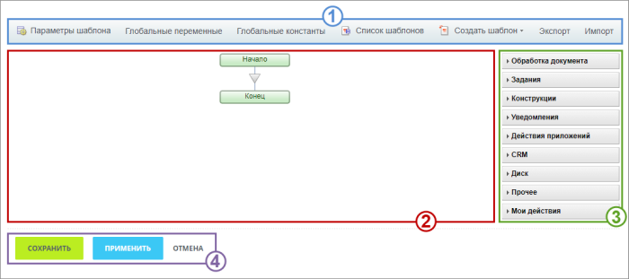
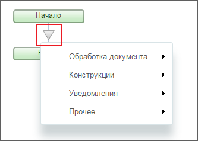
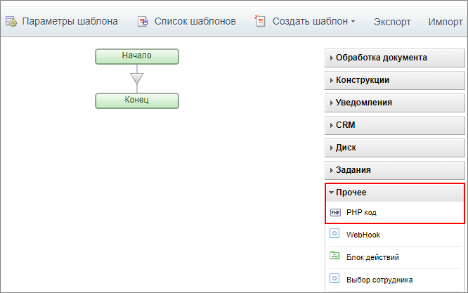
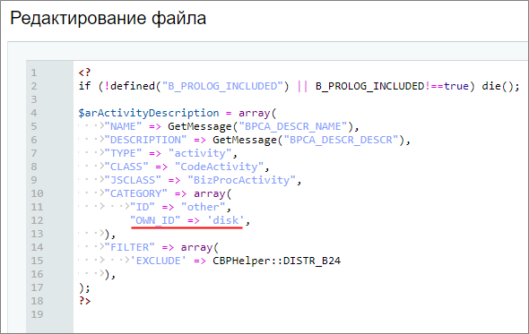
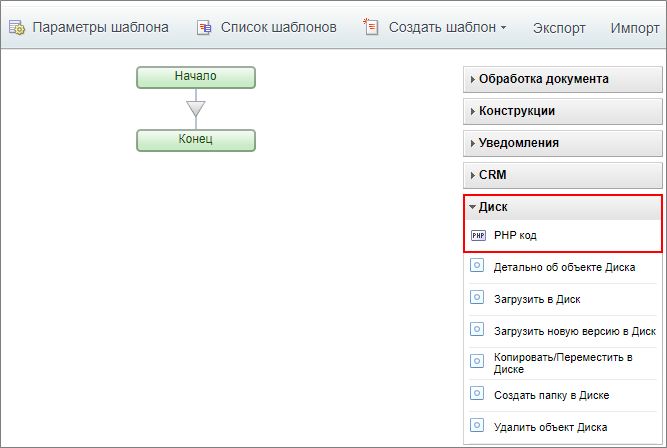
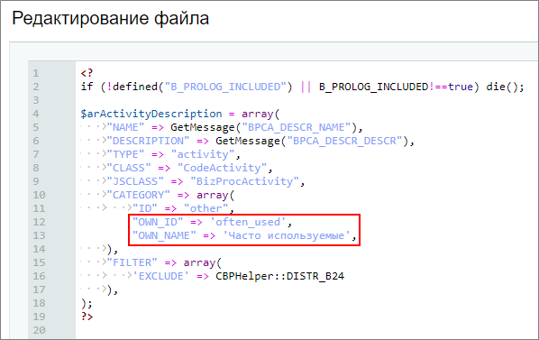
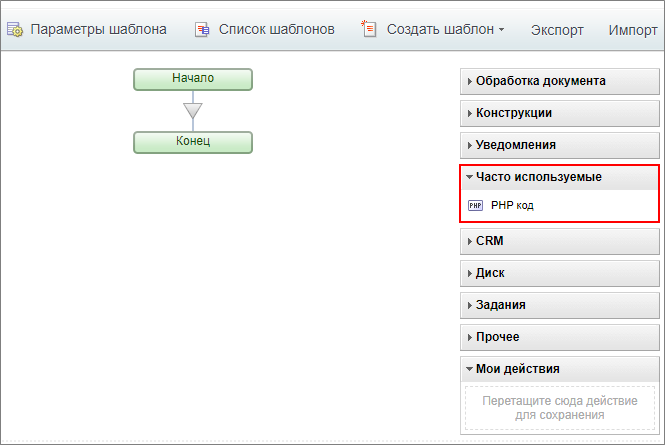
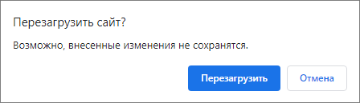

# Из чего состоит визуальный конструктор

**Навигация**
- [← Оглавление курса](index.md)
- [← Предыдущий: 3870 — Визуальный конструктор](lesson_3870.md)
- [Следующий: 23718 — Глобальные переменные и константы →](lesson_23718.md)

Официальная страница урока: https://dev.1c-bitrix.ru/learning/course/index.php?COURSE_ID=57&LESSON_ID=12409

Внешний вид визуального конструктора





### Внешний вид


Визуальный конструктор состоит из четырех областей. Его вид будет отличаться в зависимости от того, какой процесс редактируется.


### 1. Контекстная панель


Контекстная панель визуального конструктора состоит из набора кнопок:


- **Параметры шаблона** – позволяет задать/изменить
  			основные параметры
                      **Шаблон БП** представляет собой последовательность шагов (действий) от начального к конечному, которые выполняются один за другим. Необходимо таким образом и в таком порядке составить шаги (действия), чтобы реализовать нужный нам алгоритм и получить необходимый результат.
  [Подробнее](lesson_3816.md)...
  		 и параметры запуска бизнес-процесса;
- **Глобальные переменные** – переход к списку глобальных переменных;
- **Глобальные константы** – переход к списку глобальных констант;
- **Список шаблонов** – переход к списку шаблонов бизнес-процессов;
- **Создать шаблон &lt;тип_бизнес-процесса&gt;** – позволяет перейти к созданию одного из типов бизнес-процессов;
- Экспорт и Импорт
                      Процесс переноса шаблона с одного проекта на другой достаточно простой. Для этого необходимо воспользоваться кнопками на контекстной панели дизайнера бизнес-процессов.
  [Подробнее](lesson_3858.md)...
  		 – экспорт текущего шаблона бизнес-процесса и импорт шаблона бизнес-процесса взамен текущего.


### 2. Основная рабочая область


Внешний вид основной рабочей области зависит от типа БП:

			последовательный бизнес процесс

                    **Последовательный бизнес-процесс** – действия выполняются одно за другим от точки входа до точки выхода.

[Подробнее](lesson_3466.md)...

		 или

			бизнес-процесс со статусами

                    **Бизнес-процесс со статусами** – бизнес-процесс, не имеющий начала и конца, в процессе работы которого происходит переход из одного состояния (статуса) в другое с разделением прав доступа.

[Подробнее](lesson_3467.md)...

		.


Создание и редактирование шаблона бизнес-процесса, т.е. добавление некоторых действий, осуществляется простым

			перетягиванием действия

                    

		 на основную рабочую область конструктора в нужном месте шаблона бизнес-процесса. Или воспользуйтесь меню, которое доступно при нажатии на

			треугольник

                    

		 между действиями.


Для копирования действий перетащите уже существующее действие, зажав клавишу **Ctrl**. Для удаления действия служит кнопка , а для выполнения детальной настройки размещенного в шаблоне действия – кнопка . Некоторые действия

			сворачиваются

                    

		 для экономии места на экране .


### 3. Панель действий конструктора


Панель действий визуального конструктора содержит набор

			действий

                    Последовательный бизнес-процесс строится из набора действий. Каждое действие выполняет определенную функцию и имеет собственные параметры.
[Подробнее](/learning/course/index.php?COURSE_ID=57&CHAPTER_ID=05035)...

		, из которых и производится конструирование шаблона.


## Создание своих групп действий в панели действий

**Внимание**: изменения, описанные ниже, могут быть затерты обновлениями модуля Бизнес-процессы. Это не касается действий из собственного пространства `/bitrix/activities/custom/`.


Сгруппируйте действия в собственные группы. Для этого достаточно внести изменения (параметры **OWN_ID** и **OWN_NAME**) в конфигурационный файл **.description.php**, находящийся в папке конкретного действия (`/bitrix/activities/bitrix/[папка_действия]` для системных действий или `/bitrix/activities/custom/[папка_действия]` для собственных).


```

'CATEGORY' => array(
        'ID' => 'document',
        "OWN_ID" => 'crm',     // идентификатор новой создаваемой группы действий
        "OWN_NAME" => 'CRM',     // название группы, которое будет отображаться в дизайнере
    ),
```


Посмотрим пару примеров на действии **PHP код** (папка `/bitrix/activities/bitrix/codeactivity`), которое по умолчанию находится в группе

			Прочее

                    

		:


- Перенесем действие в существующую группу **Диск**. Добавим код в файл
  			.description.php
                      
  		:
  ```
  'CATEGORY' => array(
          'ID' => 'document',
          "OWN_ID" => 'disk',     // идентификатор уже существующей группы Диск
      ),
  ```
  Результат:
  
- Создадим новую группу действий **Часто используемые** и перенесем действие туда. Добавим код в файл
  			.description.php
                      
  		:
  ```
  'CATEGORY' => array(
          'ID' => 'document',
          "OWN_ID" => 'often_used',     // новый идентификатор
          "OWN_NAME" => 'Часто используемые',     // новое название группы
      ),
  ```
  Результат:
  


### 4. Кнопки управления


Если осуществляется создание/редактирование шаблона последовательного бизнес-процесса, то отображаются кнопки: **Сохранить**, **Применить** и **Отмена**.


Если же выполняется создание/редактирование шаблона бизнес-процесса со статусами, то отображается только кнопка **Вернуться к настройке статусов**, которая служит для перехода к схеме шаблона, где и выполняется сохранение/отмена внесенных изменений в статусы и их действия.


**Примечание:** Если шаблон был изменен, но не сохранен, то при попытке покинуть страницу появится

			предупреждение

                    

		 о возможной потере несохраненных данных, с возможностью сохранить изменения.


### Заключение


Мы узнали, где запустить **Визуальный конструктор** и как проектировать в нем шаблоны бизнес-процессов. Инструмент, с помощью технологии **drag&drop**, позволяет наглядно и удобно создавать и редактировать шаблоны бизнес-процессов.
