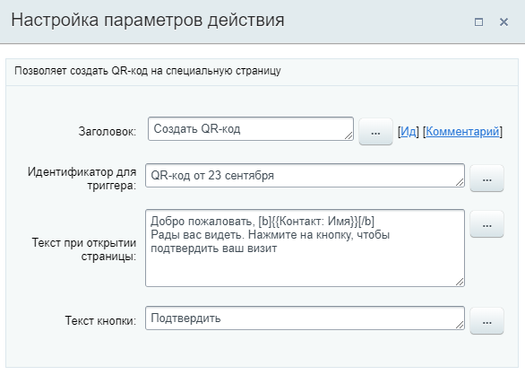
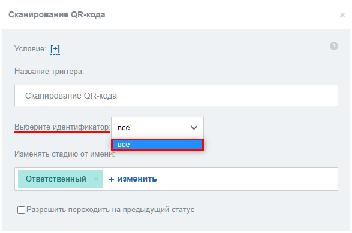
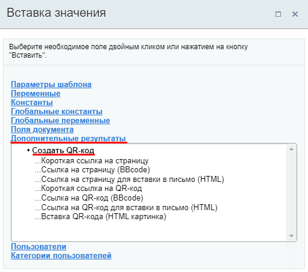
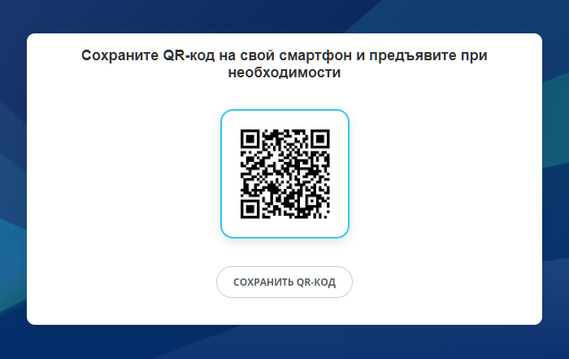
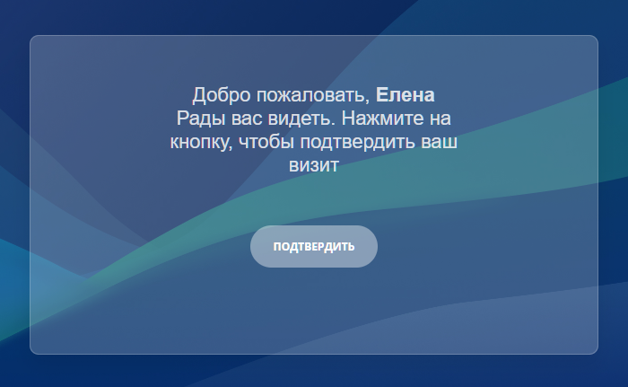
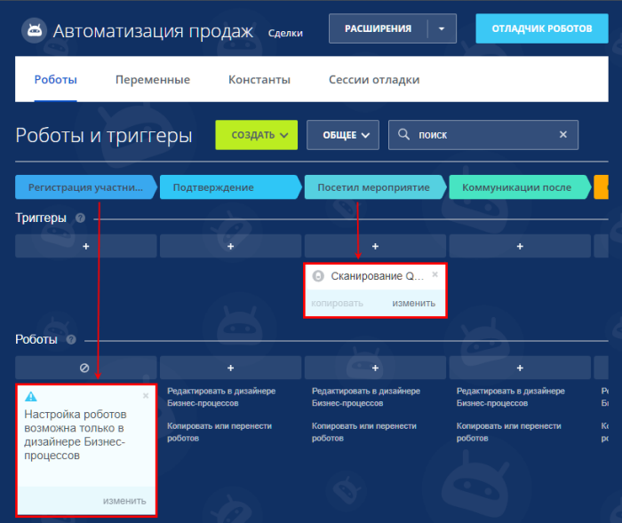

# Создать QR-код

**Навигация**
- [← Оглавление курса](index.md)
- [← Предыдущий: 7397 — Создание группы](lesson_7397.md)
- [Следующий: 26986 — Создать групповой чат →](lesson_26986.md)

Официальная страница урока: https://dev.1c-bitrix.ru/learning/course/index.php?COURSE_ID=57&LESSON_ID=12605

Действие позволяет создать QR-код на специальную страницу. Доступно только в **Битрикс24** с версии **22.600.200** модуля **CRM**.

### Описание параметров

- **Идентификатор для триггера** – укажите текст, который будет являться идентификатором для триггера **Сканирование QR-кода**. По умолчанию это «QR-код от [текущий день и месяц]». Идентификатор нужен для того, чтобы триггер передвигал только те сделки, код для которых создало конкретное действие;
  **Важно:** На текущий момент идентификаторы, указанные через бизнес-процессы, не доступны в триггере **Сканирование QR-кода**. Триггер возможно использовать, если выбрать вариант
  			все
                      
  		 в настройках триггера. Если такая схема не подходит вам, рекомендуем использовать робот
  			Создать QR-код
                      Мы добавили в CRM робота **Создать QR-код** и триггер **Сканирование QR-кода**. Эти инструменты помогут автоматизировать приглашение и регистрацию участников на мероприятиях.
  Подробнее на [helpdesk.bitrix24.ru](https://helpdesk.bitrix24.ru/open/16314660/).
  		 взамен действия бизнес-процесса.
- **Текст при открытии страницы** – текст, который увидит пользователь при открытии страницы. По умолчанию в поле задан пример текста;
- **Текст кнопки** – укажите текст кнопки подтверждения. По умолчанию текст «Подтвердить».

QR-коды, которые сформировало действие, можно отправить клиенту в письме или SMS, добавить в комментарий к сделке и так далее. Для этого разместите нужное действие в шаблоне после действия **Создать QR-код** и воспользуйтесь одним из результатов выполнения действия.

### Результаты выполнения действия

Результаты выполнения этого действия можно получить с помощью формы **Вставка значения** - **Дополнительные результаты**, в которой они будут доступны сразу после добавления действия в шаблон.

Доступно:

- Короткая ссылка на страницу
- Ссылка на страницу (BBcode)
- Ссылка на страницу для вставки в письмо (HTML)
- Короткая ссылка на QR-код
- Ссылка на QR-код (BBcode)
- Ссылка на QR-код для вставки в письмо (HTML)
- Вставка QR-кода (HTML картинка)

> Дополнительные значения рекомендуется использовать следующим образом:
>
>
> - Для **писем**: Ссылка на страницу для вставки в письмо (HTML), Ссылка на QR-код для вставки в письмо (HTML) и Вставка QR-кода (HTML картинка).
>   В первом случае клиент увидит страницу, как будто QR-код уже отсканирован, во втором случае ссылку на изображение кода, а в третьем случае в письме придёт изображение.
> - Для **SMS**: Короткая ссылка на страницу и Короткая ссылка на QR-код.
> - Для **сообщений в ленту** и **комментариев**: Ссылка на страницу (BBcode) и Ссылка на QR-код (BBcode).

### Что увидит клиент

Если клиенту отправлена ссылка на QR-код, то он увидит такую страницу:

QR-код содержит ссылку на страницу подтверждения участия. При желании клиент может скачать QR-код в виде картинки.

Перейдя по ссылке клиент увидит такую страницу:

На странице показывается текст, указанный в настройках действия (в том числе текст кнопки).

### Пример

Действие **Создать QR-код** совместно с триггером **Сканирование QR-кода** помогут автоматизировать приглашение и регистрацию участников на мероприятиях.

Рассмотрим такой краткий **сценарий**: необходимо пригласить клиентов на мероприятие и собрать информацию о том, кто посетил это мероприятие.

Допустим у нас есть ряд клиентов в CRM, которых мы приглашаем на мероприятие. Для этого в сделках у нас настроены соответствующим образом стадии:

Сначала все клиенты попадают на первую стадию сделки. На этой стадии создаём шаблон бизнес-процесса, который содержит действия создания QR-кода и отправки ссылки / QR-кода клиенту.

На третьей стадии разместим триггер **Сканирование QR-кода**. Триггер переместит сделку на эту стадию, если клиент подтвердит участие в мероприятии.

Таким образом после окончания мероприятия вы увидите, кто из клиентов действительно посетил мероприятие, а кто нет (т.е. то, какие сделки перешли на стадию Посетил мероприятие).

### Дополнительно

Также в CRM добавлен робот Создать QR-код. Подробнее в статьях на [helpdesk.bitrix24.ru](https://helpdesk.bitrix24.ru/):

- [Новые робот Создать QR-код и триггер Сканирование QR-кода](https://helpdesk.bitrix24.ru/open/16314660/);
- [Подробнее о роботе Создать QR-код и триггере Сканирование QR-кода](https://helpdesk.bitrix24.ru/open/16318550/).
