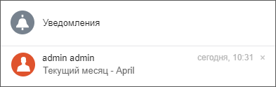
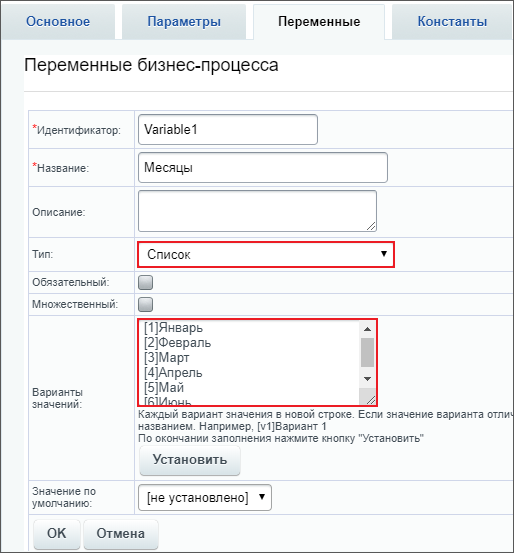
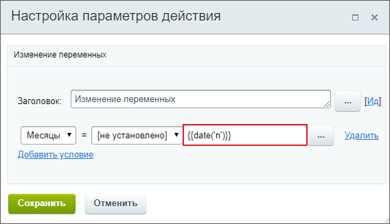
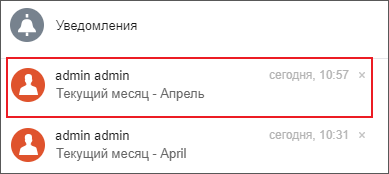
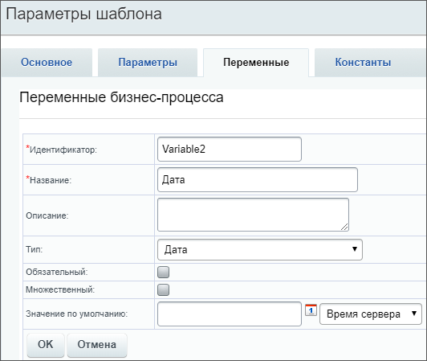
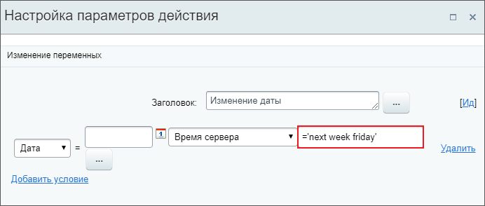
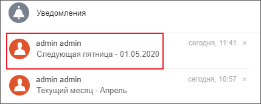
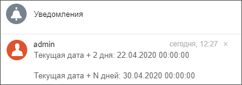

# Примеры работы с датами

**Навигация**
- [← Оглавление курса](index.md)
- [← Предыдущий: 3817 — Примеры работы со ссылками](lesson_3817.md)
- [Следующий: 5359 — Вычисляем числовые значения с записью в поля документа →](lesson_5359.md)

Официальная страница урока: https://dev.1c-bitrix.ru/learning/course/index.php?COURSE_ID=57&LESSON_ID=12840

В уроке рассмотрим возможности работы с датами в бизнес-процессах. Результаты выведем с помощью действия

			Сообщение соц.сети

                    Действие отправляет уведомление модуля социальной сети.

[Подробнее](lesson_3804.md)...

		.


### Перевод даты на русский язык


Для вывода даты используется функция

			date

                    **date** - Форматирует вывод системной даты/времени


		.  В примере используем параметр `F` - полное наименование месяца. Список всех параметров функции смотрите в [документации по PHP](https://www.php.net/manual/ru/function.date.php).


```

Текущий месяц - {{=date('F',{=System:Date})}}
```


В результате получим

			уведомление

                    

		 вида `Текущий месяц - April`.


Для получения названия месяца на русском языке понадобится создать **Список соответствия** для названий месяцев. Введем переменную бизнес-процесса типа **Список**:





В вариантах значений в квадратных скобках укажем ключ - номер месяца, а после - значение (название месяца на русском языке).


Вернемся к шаблону бизнес-процесса и перед сообщением соц.сети добавим действие

			Изменение переменных

                    

		 в котором укажем функцию `{{=date('n')}}`, где **n** - порядковый номер месяца без ведущего нуля (из документации по PHP).


В действии **Уведомление соц. сети** поменяем текст сообщения на вывод нашей переменной **Variable1**:


```

Текущий месяц - {=Variable:Variable1 > printable}
```


Результат:





Таким же образом можно выводить дни недели и др. подобные даты.


### Относительный формат даты


Задание: необходимо вывести дату - пятница следующей недели. Сделать это можно с помощью работы [функции strtotime](https://www.php.net/manual/ru/function.strtotime)  и [относительных форматов PHP](https://www.php.net/manual/ru/datetime.formats.php?#datetime.formats.relative).


Создадим новую переменную

			Дата

                    

		 и снова воспользуемся действием **Изменение переменных**, как в примере выше. Укажем значение `='next week friday'`:





А в тексте сообщения соц. сети выведем переменную **Дата**.


```

Следующая пятница - {=Variable:Variable2 > printable}
```


Результат





### Добавление N дней из параметра


Сначала посмотрим на простой пример: прибавим к текущей дате точное количество дней.


Для этого понадобится функция [dateadd](lesson_4912.md#dateadd):


```

Текущая дата + 2 дня: {{=dateadd({=System:Date}, '2d')}} // прибавим 2 дня к текущей дате
```


Теперь посмотрим, как правильно добавлять количество дней, которое хранится в параметре БП:


```

Текущая дата + N дней: {{=dateadd({=System:Date}, {=Template:Parameter1} & 'd')}} // прибавим дни из параметра к текущей дате
```


**Важно**! Для правильного указания количества дней из параметра применен оператор [конкатенации](http://www.php.net/manual/ru/language.operators.string.php), который возвращает строку, представляющую собой соединение левого и правого аргумента.


Результат (при запуске БП для параметра указано значение `10`):





Таким же образом выполняется вычитание дней, только добавляется символ минуса:


```

Текущая дата - 2 дня: {{=dateadd({=System:Date}, '-2d')}} // отнимем 2 дня из текущей даты

Текущая дата - N дней: {{=dateadd({=System:Date}, '-' & {=Template:Parameter1} & 'd')}} // отнимем дни, указанные в параметре, из текущей даты
```


### Разница между двумя датами


Функция **datediff()** позволяет вычислять разницу между двумя датами.


Например, вычисление сколько дней прошло с момента создания элемента до текущего момента может выглядеть так:


```
{{=datediff({{Дата создания элемента}},{=System:NowLocal},"%d")}}
```


, где **%d** - значение параметра форматирования результата. Все значения параметра смотрите в [документации PHP](https://www.php.net/manual/en/dateinterval.format.php).


Для правильного использования функции, важно понимать, какой результат возвращает функция и как его использовать.


Возьмем две даты (с одинаковым днём):

- Date1: 18.01.2022 **12:15:25**
- Date2: 18.01.2022 **18:31:00**


Посчитаем разницу между этими датами:


```
{{=datediff({Date1},{Date2},"%h часов %i минут %s секунд")}}
// результат: 6 часов 15 минут 35 секунд
```


Если для этих же дат мы запишем функцию только со значением **%i**:


```
{{=datediff({Date1},{Date2},"%i")}}
// результат: 15
```


, то получим результат: `15`. Т.о. функция **datediff** не переводит разницу в одну единицу времени (в минуты или в секунды). Её результатом всегда является расчет в полном формате (сколько прошло лет, месяцев, дней, часов и т.д. между двумя датами). А при помощи третьего параметра функции мы указываем лишь какие данные из этого результата отобразить.


Исключением является вариант **%a**, который выводит общее количество дней между датами. Проверим на том же примере, только для первой даты изменим год на 2020:

- Date1: 18.01.2020 12:15:25
- Date2: 18.01.2022 18:31:00


```
{{=datediff({Date1},{Date2},"%d")}}
// %d - количество дней
// результат: 0
```


```
{{=datediff({Date1},{Date2},"%a")}}
// %a - общее количество дней
// результат: 731
```


Как видим, в первом варианте количество дней равно **0**, т.к. прошло ровно 2 года и 0 дней. А во втором варианте результат **731** день, т.е. количество дней за 2 года.


### Проверка корректности времени


Выражение используется для полей документа, переменных или параметров шаблона.


```

	=if(and((intval(substr({=Template:Parameter1}, 0, 2)) >= 0), (intval(substr({=Template:Parameter1}, 0, 2)) < 25), (substr({=Template:Parameter1}, 2, 1) = ":"), (intval(substr({=Template:Parameter1}, 3, 2)) >= 0), (intval(substr({=Template:Parameter1}, 3, 2)) < 60)), {=Template:Parameter1}, "время указано неправильно")
```


Если в параметре `{=Template:Parameter1}` передается время (в 24 часовом формате `ЧЧ:ММ`, например **21:45**), то возвращается его значение. Иначе вернется **время указано неправильно**.


### Дополнительно


- [Функции калькулятора выражений](lesson_4912.md).
