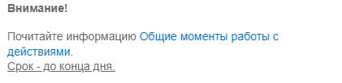

# Практические задания

**Навигация**
- [← Оглавление курса](index.md)
- [← Предыдущий: 7143 — Пример использования действия "Утверждение документа"](lesson_7143.md)
- [Следующий: 8445 — Распространенные ошибки при работе с бизнес-процессами →](lesson_8445.md)

Официальная страница урока: https://dev.1c-bitrix.ru/learning/course/index.php?COURSE_ID=57&LESSON_ID=13044

После изучения главы рекомендуем выполнить несколько практических заданий.

### Практические задания

После изучения главы **Действия** рекомендуем выполнить несколько практических заданий. Выполнять их необходимо на установленной на локальный компьютер

			пробной версии Битрикс24 в коробке

                    В главе описаны предварительные шаги для установки продукта, шаги мастера установки, а также выбор и первоначальная настройка портала для быстрого развертывания своего проекта.

[Подробнее](https://dev.1c-bitrix.ru/learning/course/index.php?COURSE_ID=135&CHAPTER_ID=04702&LESSON_PATH=10495.4495.4702)...

		.

Практические задания состоят из вопроса, скриншота или видео с конечным результатом и объяснением как это получить в спойлере. Не торопитесь подглядывать в спойлер. 

**Примечание**: практические задания предназначены для ознакомления с **интерфейсом** и получения базовых навыков работы с бизнес-процессами. В заданиях **НЕ** изучается планирование и создание сложных бизнес-процессов.

1. Создайте новый процесс с названием **Уведомления** в Процессах ленты новостей. Добавьте для процесса новый шаблон последовательного бизнес-процесса и действие
  			Сообщение соц. сети
                      Действие отправляет уведомление модуля социальной сети.
  [Подробнее](lesson_3804.md)...
  		. В действии заполните параметры следующим образом:
  ## Решение
  **Задание составлено по материалу уроков:**
  - [Общие моменты](lesson_12321.md);
  - [Сообщение соц. сети](lesson_3804.md).
  **Результат:**
  <!-- &lt;iframe title="линейное задание 85" src="https://www.youtube.com/embed/rA2bpOru-yI?feature=oembed&rel=0" allow="autoplay; encrypted-media" allowfullscreen="" width="853" height="480" frameborder="0"&gt;
  &lt;/iframe&gt; -->

  - Замените заголовок на свой вариант;
  - Добавьте комментарий;
  - В качестве отправителя укажите Автора, а получателем – группу Администраторы. Добавьте группу через раздел "Категории пользователей" в форме Вставка значения;
  - Напишите текст и отформатируйте его при помощи bb-code, чтобы получился такой результат:
    
    где текст синим цветом – это ссылка на урок [Общие моменты](lesson_12321.md).
2. Создайте ещё один новый шаблон последовательного БП (в процессе из первого задания или в любом удобном вам месте). Добавьте и настройте нужные действия так, чтобы бизнес процесс выполнял следующую задачу:
  Меняйте заголовки действий и добавляйте комментарии, где вам кажется необходимо, для лучшей читаемости шаблона.
  ## Решение
  **Задание составлено по материалам уроков:**
  - [Общие моменты](lesson_12321.md);
  - [Условие](lesson_3789.md);
  - [Задача](lesson_3805.md);
  - [Сообщение соц. сети](lesson_3804.md).
  **Результат:**
  <!-- &lt;iframe title="линейное задание 86" src="https://www.youtube.com/embed/5-kReQ_obvY?feature=oembed&rel=0" allow="autoplay; encrypted-media" allowfullscreen="" width="853" height="480" frameborder="0"&gt;
  &lt;/iframe&gt; -->

  - Запрашивал информацию у Администраторов, надо ли создавать задачу. Получал ответ Да/Нет, а также пользователя, который будет Ответственным за задачу;
  - В случае, если указано Да, должна быть создана важная задача на указанного пользователя и отправлено уведомление этому пользователю о создании задачи;
  - В случае, если указано Нет, должно быть отправлено уведомление пользователю, запустившему БП, что задачу создавать не нужно;
3. Для выполнения этого задания предварительно привяжите к одной Сделке несколько Контактов.
  Теперь с помощью бизнес-процессов реализуйте массовое изменение поля **Тип контакта** для всех привязанных к Сделке контактов. Указанное поле Контактов должно измениться по запуску БП из Сделки. Новое значение для поля указывает пользователь при ручном запуске БП.
  Нужна подсказка!
                      1. Для реализации такого сценария понадобится создать два шаблона: один для Контактов и один для Сделки.
  2. Вам пригодятся такие действия, как **Итератор** и **Запуск бизнес-процесса**.
  3. Список всех привязанных к сделке Контактов хранится в поле документа **Контакты**.
  ## Решение
  **Задание составлено по материалам уроков:**
  - [Изменение документа](lesson_3785.md);
  - [Итератор](lesson_10481.md);
  - [Запуск бизнес-процесса](lesson_7721.md).
  **Результат:**
  <!-- &lt;iframe title="линейное задание 87" src="https://www.youtube.com/embed/NxoHzFcNje8?feature=oembed&rel=0" allow="autoplay; encrypted-media" allowfullscreen="" width="853" height="480" frameborder="0"&gt;
  &lt;/iframe&gt; -->

### Где выполнять задания?

Выполнять их необходимо на установленной на локальный компьютер

			пробной версии Битрикс24 в коробке

                    В главе описаны предварительные шаги для установки продукта, шаги мастера установки, а также выбор и первоначальная настройка портала для быстрого развертывания своего проекта.

[Подробнее](https://dev.1c-bitrix.ru/learning/course/index.php?COURSE_ID=135&CHAPTER_ID=04702&LESSON_PATH=10495.4495.4702)...

		. Демоверсия работает 30 дней.

Самый простой способ – это подготовить демоверсию с помощью виртуальной машины. Подробная информация об установке представлена в уроке [Где практиковаться и выполнять задания](lesson_10241.md).

**Примечания:**

1. Настоятельно рекомендуем **НЕ** выполнять задания на работающем, «боевом» портале.
2. Если вы всё же пытаетесь выполнять задания на работающем портале, где вы не являетесь администратором, то не все задания можно выполнить.
