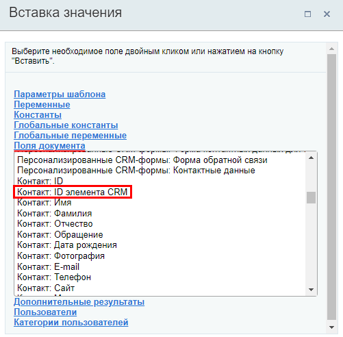
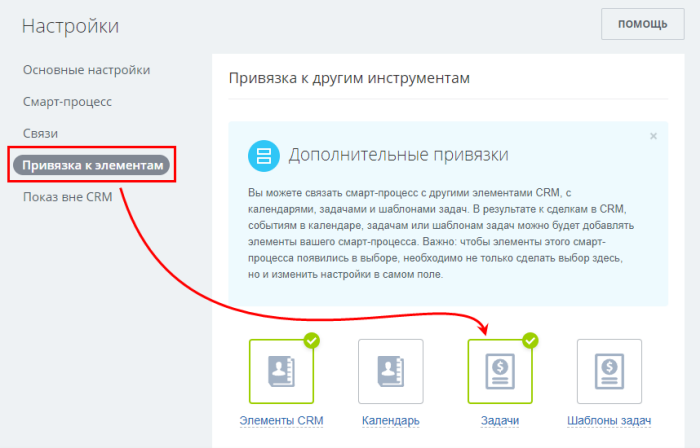
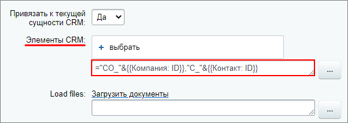
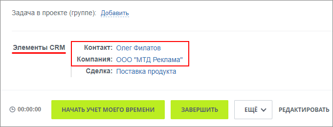

# Коды подстановки сущностей

**Навигация**
- [← Оглавление курса](index.md)
- [← Предыдущий: 12407 — Модификация данных](lesson_12407.md)
- [Следующий: 3817 — Примеры работы со ссылками →](lesson_3817.md)

Официальная страница урока: https://dev.1c-bitrix.ru/learning/course/index.php?COURSE_ID=57&LESSON_ID=13640

В некоторых сценариях подстановка сущностей системы из формы "Вставка значения" не решает задачу. Например, при необходимости использования переменного ID сущности. Помогут в решении таких задач специальные коды.


### Пользователь


В параметрах действий, где указываются пользователи, для подстановки пользователя можно использовать код, состоящий из слова **user** и идентификатора ID.


В простом случае, запись с известным числовым ID в поле действия БП будет выглядеть так:


```
="user_5"
```


где число `5` – идентификатор пользователя.


Если идентификатор является переменным и подставляется через форму Вставка значения (например, он записан в переменную или в какое-то поле документа), то в записи потребуется использовать оператор конкатенации &. Например:


```
="user_" & {=Variable:Variable1}
```


где `{=Variable:Variable1}` – переменная шаблона БП.


### Группы пользователей


В параметрах действий, где указываются пользователи или группы пользователей есть возможность использовать код, состоящий из слова **group** и идентификатора **ID**. При этом на портале существуют группы пользователей различных типов (группы социальной сети, подразделения и т.д.) и система должна понимать к какому именно типу требуется обратиться. Поэтому, важно указать верный вариант записи. Все варианты собраны в таблице (число 7 - пример ID):


| \| Код \| Описание \| Пример полной записи \|<br>\| --- \| --- \| --- \|<br>\| Основная система (главный модуль)<br>Группы и пользователи в административном разделе по пути Настройки &gt; Пользователи. Подробнее в уроках [Работа с учетными записями пользователей](https://dev.1c-bitrix.ru/learning/course/index.php?COURSE_ID=48&LESSON_ID=2004) и [Группы пользователей](https://dev.1c-bitrix.ru/learning/course/index.php?COURSE_ID=48&LESSON_ID=2487) учебного курса «Администратор сервиса Битрикс24 (коробочная версия)». \|  \|  \|<br>\| **G** \| Группа пользователей \| `group_G7` \|<br>\| **U** \| Пользователь \| `group_U7` \|<br>\| Интранет (intranet)<br>Подразделения структуры компании. Подробнее в уроке [Структура компании](https://dev.1c-bitrix.ru/learning/course/index.php?COURSE_ID=48&LESSON_ID=2777) учебного курса «Администратор сервиса Битрикс24 (коробочная версия)». \|  \|  \|<br>\| **IU** \| Пользователь отдела (подразделения) \| `group_IU7` \|<br>\| **D** \| Все сотрудника отдела \| `group_D7` \|<br>\| **DR** \| Все сотрудники отдела с подотделами \| `group_DR7` \|<br>\| **Dextranet** \| Все <br>публичные сотрудники<br>Публичный сотрудник - это обязательно сотрудник компании, обладающий свойством публичности на сайте экстранета, т.е данный сотрудник всегда доступен для общения и включения в любую рабочую группу экстранета.<br>Подробнее в уроке [Публичный сотрудник](https://dev.1c-bitrix.ru/learning/course/index.php?COURSE_ID=48&LESSON_ID=2724) курса Администратор сервиса Битрикс24 (коробочная версия). \| `group_Dextranet` \|<br>\| **UA** \| Все пользователи компании \| `group_UA` \|<br>\| Социальная сеть (socnet)<br>Группы и проекты, которые открываются из основного меню портала. Подробнее на [helpdesk.bitrix24.ru](https://helpdesk.bitrix24.ru/open/6481473/). \|  \|  \|<br>\| **SU** \| Пользователь социальной сети \| `group_SU7` \|<br>\| **SG1_A** \| Владелец группы \| `group_SG7_A` \|<br>\| **SG1_E** \| Модераторы группы \| `group_SG7_E` \|<br>\| **SG1_K** \| Все члены группы \| `group_SG7_K` \| |
| --- |


> **Важно понимать:** Если в поле, где должен быть указан пользователь, добавляется код группы, то
> система берет
>
> 			первого пользователя
>
>
>
>                     Первым пользователем будет тот, что создан ранее остальных, т.е. с меньшим идентификатором.
>
>
>
> 		 этой группы (подходящего по условиям).


В простом случае, запись с известным числовым ID в поле действия БП будет выглядеть так:


```
="group_D3"
```


Если идентификатор является переменным и подставляется через форму Вставка значения (например, он записан в переменную или в какое-то поле документа), то в записи потребуется использовать оператор конкатенации &. Например:


```
="group_SG" & {=A52792_89450_17178_72721:GroupId} & "_K"
```


где `{=A52792_89450_17178_72721:GroupId}` – идентификатор группы, созданной ранее действием

			Создать группу

                    Действие позволяет создать группу.

[Подробнее](lesson_7397.md)...

		.


### Сущности CRM


В действиях, не относящихся к разделу CRM, для добавления элементов через форму Вставка значения необходимо использовать

			поля документа

                    

		 вида `Контакт: ID элемента CRM`. Но такие поля есть не для всех сущностей и позволяют использовать только связанные с документом элементы CRM. Другой вариант - использовать следующий синтаксис:


- Контакты: `="C_"&{{ID}}`
- Сделки: `="D_"&{{ID}}`
- Лиды: `="L_"&{{ID}}`
- Компании: `="CO_"&{{ID}}`
- Счета (новые): `="SI_"&{{ID}}`


Запись состоит из специального кода сущности, оператора конкатенации и идентификатора сущности. Идентификатором может быть переменная из формы Вставка значения. Так вы сможете использовать любые элементы CRM, не обязательно связанные с текущим документом.


## Как привязать элемент смарт-процесса

Особенностью привязки элемента смарт-процесса является то, что у каждого смарт-процесса имеется свой уникальный префикс. В настоящий момент автоматически этот префикс пока не определяется, но вы можете определить его самостоятельно и выполнить привязку аналогично другим элементам CRM.


- Сначала определите **Идентификатор типа смарт-процесса**. Самый быстрый способ, это перейти на страницу списка Смарт-процессов (CRM &gt; Настройки &gt; Список смарт-процессов) и посмотреть в таблице в колонке Идентификатор типа смарт-процесса. Например, он может быть равен **174**.
- Cконвертируйте данное число из десятичной системы в
  			шестнадцатеричную
                      Например, с помощью конвертера [https://www.translatorscafe.com/unit-converter/ru-RU/numbers/4-3/hexadecimal-decimal/](https://www.translatorscafe.com/unit-converter/ru-RU/numbers/4-3/hexadecimal-decimal/).
  		.  В случае с идентификатором равным 174, получаем значение **ae**.
- Берем полученное значение в нижнем регистре (это важно!) и к полученному значению дописываем латинскую букву **T** в начале. Таким образом получаем префикс для конкретного смарт-процесса - **Tae**.


Данный код используем в привязке в формате `="Tae_"&{{ID}}`, где {{ID}} - числовой ID элемента смарт-процесса.


**Примечание:** Также проверьте, чтобы для смарт-процесса была включена привязка к

			Задачам

                    

		. Если привязка выключена - то и через действие бизнес-процесса привязка выполнена не будет.


#### Пример привязки Контакта и Компании, связанных со сделкой, с помощью префиксов


**Задача**: при

			создании задачи

                    Действие **Задача** позволяет создать задачу.

[Подробнее](lesson_3805.md)...

		 из бизнес-процесса сделки, привязывать **Контакт** и **Компанию**, связанные с этой сделкой.


Для привязки Контакта нам понадобится использовать `"C_"&`, а для Компании - `"CO_"&`. В качестве идентификаторов этих элементов выберем в форме Вставка значения, секции **Поля документа**: `Контакт: ID` и `Компания: ID`.


Итоговая запись будет выглядеть так:





В результате при запуске БП в сделке будет создана задача с привязками к самой сделке (текущей сущности) и к связанными с ней Контакту и Компании:



