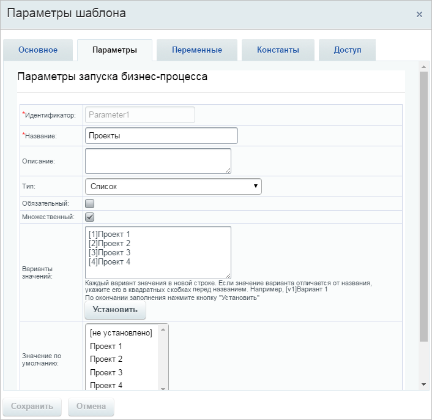
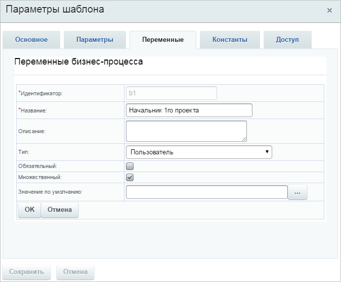
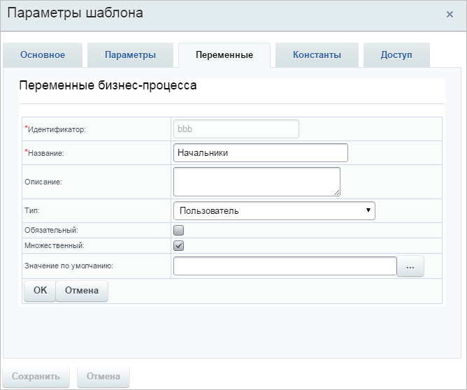
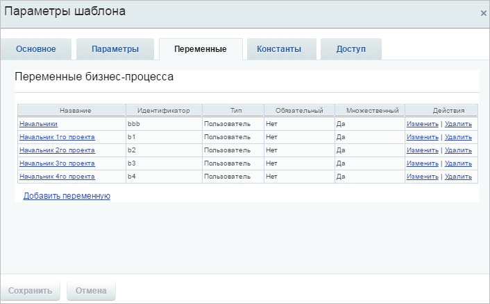
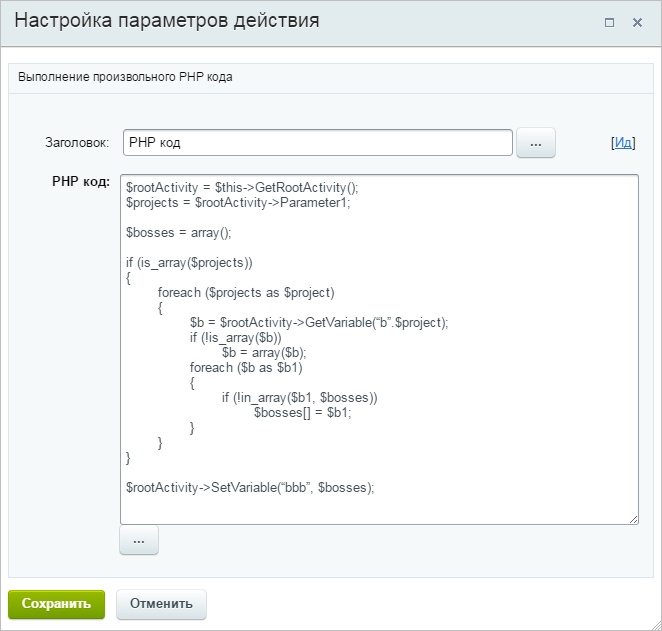

# Получение списка пользователей

**Навигация**
- [← Оглавление курса](index.md)
- [← Предыдущий: 15308 — Работа с пользовательским полем сотрудника из БП](lesson_15308.md)
- [Следующий: 20686 — Автоматический запуск бизнес-процессов и роботов →](lesson_20686.md)

Официальная страница урока: https://dev.1c-bitrix.ru/learning/course/index.php?COURSE_ID=57&LESSON_ID=1898

|  | ### Получаем список конкретных пользователей |
| --- | --- |


> **Задание:** необходимо отправить сообщение руководителям всех проектов, которые были выбраны при запуске бизнес-процесса.


Основной сложностью является получение списка руководителей для последующей отправки им сообщения или постановки задач. Для того, чтобы это сделать можно воспользоваться несколькими штатными действиями, но это может значительно усложнить бизнес-процесс. С помощью действия PHP-код можно заменить целую группу действий одним. Рассмотрим, как это сделать.


В начале необходимо задать список проектов. Для этого заведем параметр бизнес-процесса типа **Список**, указав, что он множественный.





Перечислим все проекты в поле **Варианты значений**, обязательно указав их идентификаторы в квадратных скобках – их мы будем использовать в коде.


Далее необходимо указать руководителя/руководителей проектов. Для этого создадим множественные переменные типа **Пользователь**, соответствующие каждому проекту, в которых будут указаны руководители. Число в идентификаторе переменной будет соответствовать идентификатору проекта, с котором она связана.





Отдельную переменную заведем для списка руководителей, которым будут отправлены сообщения.





Итоговый список переменных будет выглядеть следующим образом.





Теперь остается поместить код в действие **PHP-код**.





## PHP-код действия

```

$rootActivity = $this->GetRootActivity();
$projects = $rootActivity->Parameter1;

$bosses = array();

if (is_array($projects))
{
	foreach ($projects as $project)
	{
		$b = $rootActivity->GetVariable(“b”.$project);
		if (!is_array($b))
			$b = array($b);
		foreach ($b as $b1)
		{
			if (!in_array($b1, $bosses))
				$bosses[] = $b1;
		}
	}
}

$rootActivity->SetVariable('bbb', $bosses);

```


Как будет работать данное действие:


1. В переменную `$projects` записывается список идентификаторов проектов, которые были выбраны при запуске БП (параметр `Parameter1` бизнес-процесса).
2. Затем в цикле для каждого выбранного проекта мы получаем значение переменной, соответствующей руководителю проекта.
3. Все руководители записываются в переменную `bbb`.


После того, как действие будет выполнено, переменную можно будет использовать в любых действиях бизнес-процессов.
