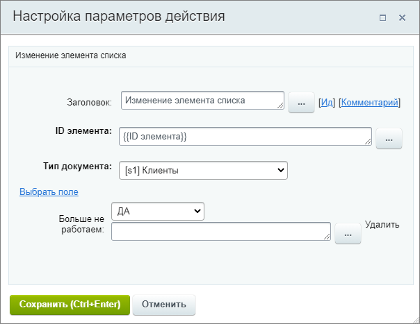

# Изменить элемент списка

**Навигация**
- [← Оглавление курса](index.md)
- [← Предыдущий: 3785 — Изменение документа](lesson_3785.md)
- [Следующий: 23424 — Получить информацию о задаче →](lesson_23424.md)

Официальная страница урока: https://dev.1c-bitrix.ru/learning/course/index.php?COURSE_ID=57&LESSON_ID=20748

Действие позволяет изменить значение полей внутри элемента указанного списка.

#### Описание параметров

- **ID элемента** – укажите элемент, который будет изменен. Например: текущий элемент {{ID элемента}};
- **Тип документа** – выберите тип изменяемого документа. Это может быть список, процесс или список групп / проектов;
- Ссылка **Выбрать поле** – отметьте одно или несколько полей, которые будут изменены в выбранном ранее документе. Набор полей зависит от документа.

Пример настройки: изменение поля элемента списка Клиенты. Действие устанавливает значение **ДА** для поля Больше не работаем.

