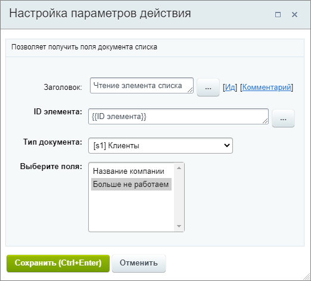
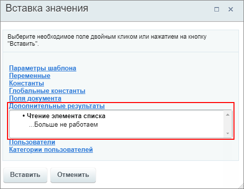

# Получить информацию об элементе списка

**Навигация**
- [← Оглавление курса](index.md)
- [← Предыдущий: 23424 — Получить информацию о задаче](lesson_23424.md)
- [Следующий: 3781 — Публикация документа →](lesson_3781.md)

Официальная страница урока: https://dev.1c-bitrix.ru/learning/course/index.php?COURSE_ID=57&LESSON_ID=20750

Действие позволяет получить значения полей элемента указанного списка.

#### Описание параметров

- **ID элемента** – укажите элемент для чтения. Например: текущий элемент {{ID элемента}}, для которого запущен бизнес-процесс;
- **Тип документа** – выберите тип документа для чтения. Это может быть список, процесс или список групп / проектов;
- **Выберите поля** – отметьте поля, значения которых необходимо получить. Для выбора нескольких вариантов зажмите клавишу **Ctrl** на клавиатуре. Набор полей зависит от выбранного типа документа.

Пример настройки: чтение значения поля элемента списка Клиенты.

Полученные значения будут храниться в секции **Дополнительные результаты** в форме Вставка значения.

