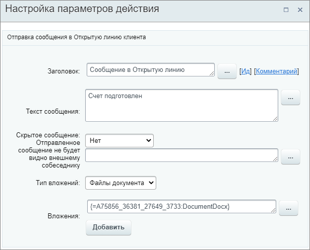

# Отправить сообщение в чат

**Навигация**
- [← Оглавление курса](index.md)
- [← Предыдущий: 26988 — Отправить сообщение в личный чат](lesson_26988.md)
- [Следующий: 3801 — Календарь →](lesson_3801.md)

Официальная страница урока: https://dev.1c-bitrix.ru/learning/course/index.php?COURSE_ID=57&LESSON_ID=20754

Действие отправляет сообщение клиенту в мессенджеры и соцсети, чтобы передать информацию или сообщить об изменениях.

**Примечание:** Действие доступно только в Битрикс24.

#### Описание параметров

- **Текст сообщения** – задается текст сообщения, который будет отправлен в открытую линию клиента;
- **Скрытое сообщение** – отметьте **Да**, чтобы сообщение было скрытым;
- **Тип вложений** – укажите тип вложения, которое нужно прикрепить к сообщению. Доступны варианты: **Файлы документа**  и **Диск**;
- **Вложения** – выберите вложение с помощью формы **Вставка значения** (если был выбран тип Файлы документа) или с **диска** (если был выбран тип Диск).

Пример настройки: уведомление клиента о подготовке счета. В качестве вложения выбран файл c помощью формы **Вставка значения** из дополнительных результатов действия

			Создание документа CRM

                    Действие создаёт документ CRM.
[Подробнее](lesson_20776.md)...

		.

