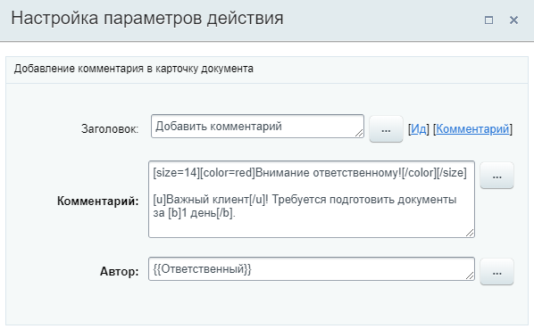
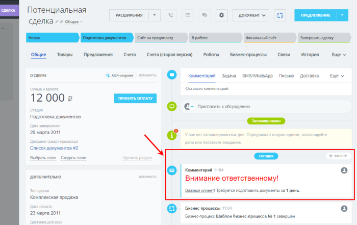

# Добавить комментарий в элемент

**Навигация**
- [← Оглавление курса](index.md)
- [← Предыдущий: 20774 — Добавить клиента в список исключений](lesson_20774.md)
- [Следующий: 23566 — Добавить товарную позицию →](lesson_23566.md)

Официальная страница урока: https://dev.1c-bitrix.ru/learning/course/index.php?COURSE_ID=57&LESSON_ID=20760

Действие добавляет комментарий от сотрудника в

			таймлайн элемента CRM

                    Таймлайн – часть карточки элемента CRM, в которой фиксируются изменения.

Подробнее на [helpdesk.bitrix24.ru](https://helpdesk.bitrix24.ru/open/16749348/).

		.

#### Описание параметров

- **Комментарий** – задается текст сообщения комментария. Для текста доступны вставка через форму
  			Вставка значения
                      При работе с бизнес-процессом в параметрах действий, параметрах шаблона и настройках статуса есть возможность указывать как собственный текст (заданный вручную), так и использовать различные переменные значения (поля документа и прочие данные, которые могут меняться и поэтому не задаются вручную). Для подстановки таких переменных значений используется специальная форма **Вставка значения**.
  [Подробнее](lesson_12383.md)...
  		 и форматирование
  			BBCode
                      **BBCode** – язык разметки, используемый для форматирования сообщений.
  Подробнее на [Википедии](https://ru.wikipedia.org/wiki/BBCode)
  		 (`[b]`, `[i]`, `[s]`, `[u]`, `[url]`, `[img]`, `[color]`, `[size]`, `[list]` и `[table]`).
- **Автор** – укажите от чьего имени будет оставлен комментарий.

#### Пример

Добавление комментария в сделке о важности клиента и быстрой подготовке документов. Используется форматирование bbcode. В качестве автора комментария выбран **Ответственный** (форма Вставка значения, Поля документа &gt; Ответственный.

В результате форматированный комментарий добавляется в сделку:

