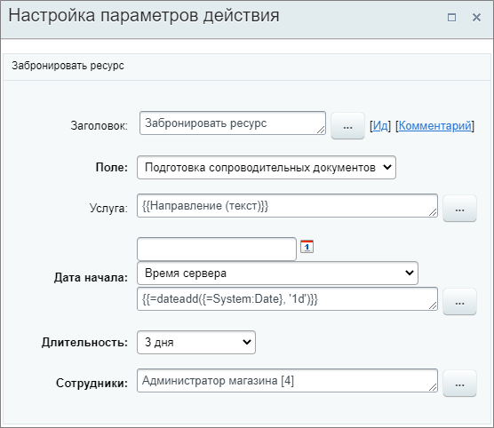

# Забронировать ресурс

**Навигация**
- [← Оглавление курса](index.md)
- [← Предыдущий: 23566 — Добавить товарную позицию](lesson_23566.md)
- [Следующий: 24418 — Завершить задачу →](lesson_24418.md)

Официальная страница урока: https://dev.1c-bitrix.ru/learning/course/index.php?COURSE_ID=57&LESSON_ID=20762

Действие бронирует ресурс.

**Примечание.** Действие аналогично [бронированию ресурсов](https://helpdesk.bitrix24.ru/open/7525323) в публичной части CRM.

#### Описание параметров

- **Поле** – выберите поле из существующих полей типа
  			бронирование ресурсов
                      Для лидов и сделок можно создать поле с типом **Бронирование ресурсов**.
  Подробнее на [helpdesk.bitrix24.ru](https://helpdesk.bitrix24.ru/open/7525323).
  		;
- **Услуга** – укажите услугу с помощью формы «Вставка значения»;
- **Дата начала** – установите время начала бронирования (можно указать конкретную дату и время из календаря или с помощью формы «Вставка значения»);
- **Длительность** – выберите длительность бронирования ресурса из списка;
- **Сотрудники** – укажите ответственного сотрудника.

Пример настройки: выбрано поле **Подготовка сопроводительных документов** и в качестве услуги выбрано направление сделки. Дата начала установлена с помощью

			функции dateadd

                    Посмотрим на простой пример: прибавим к текущей дате точное количество дней.
[Подробнее](lesson_12840.md)...

		 калькулятора выражений и выбрана длительность бронирования – 3 дня. Сотрудник – администратор магазина.

