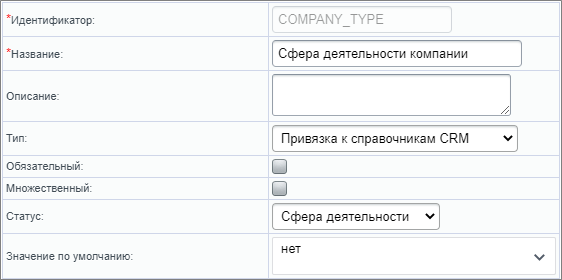
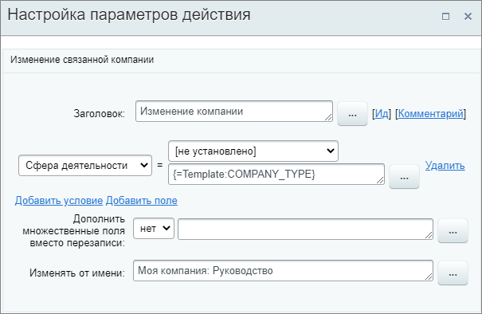

# Изменить компанию

**Навигация**
- [← Оглавление курса](index.md)
- [← Предыдущий: 25718 — Запланировать дело](lesson_25718.md)
- [Следующий: 20766 — Изменить контакт →](lesson_20766.md)

Официальная страница урока: https://dev.1c-bitrix.ru/learning/course/index.php?COURSE_ID=57&LESSON_ID=20764

Действие изменяет данные в полях связанной компании.

#### Описание параметров

- **Добавить условие** – по нажатии добавляется новая строка, в которой необходимо выбрать существующее поле из списка и указать его новое значение;
- **Добавить поле** – открывается форма для добавления. После создания поля укажите его значение;
- **Дополнить множественные поля вместо перезаписи** – если поле является множественным, выберите **Да** для дополнения списка вариантов новым значением. Иначе старое значение будет перезаписано;
- **Изменять от имени** – укажите от чьего имени будет внесено изменение.

Пример настройки: изменение поля **Сфера деятельности** компании, связанной со сделкой, в которой запущен бизнес-процесс. Новое значение задается с помощью

			параметра

                    Параметры используются для явного указания каких-либо значений во время
исполнения бизнес-процесса. [Подробнее](lesson_3816.md)...

В примере использовался такой параметр:

		 при запуске бизнес-процесса.

