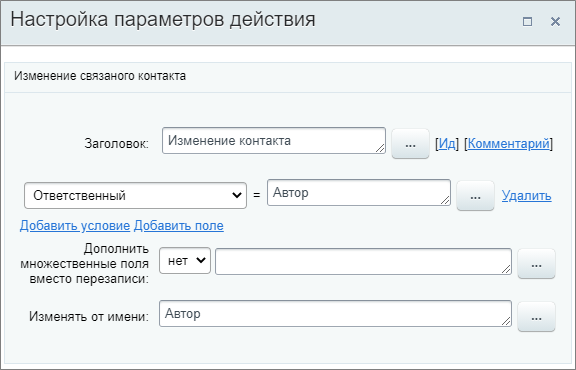

# Изменить контакт

**Навигация**
- [← Оглавление курса](index.md)
- [← Предыдущий: 20764 — Изменить компанию](lesson_20764.md)
- [Следующий: 20768 — Изменить наблюдателей →](lesson_20768.md)

Официальная страница урока: https://dev.1c-bitrix.ru/learning/course/index.php?COURSE_ID=57&LESSON_ID=20766

Действие изменяет данные в полях

			связанного

                    Например, контакта привязанного к сделке, в которой запущен бизнес-процесс.

		 контакта.

#### Описание параметров

- **Добавить условие** – по нажатии добавляется новая строка, в которой необходимо выбрать существующее поле контакта из списка и указать его новое значение. Таким образом можно в одном действии выполнить все необходимые изменения;
- **Добавить поле** – открывается форма для добавления. После создания поля укажите его значение;
- **Дополнить множественные поля вместо перезаписи** – если поле является множественным, выберите **Да** для дополнения списка вариантов новым значением. Иначе старое значение будет перезаписано;
- **Изменять от имени** – укажите от чьего имени будет внесено изменение.

Пример настройки: изменение поля **Ответственный** контакта, связанного со сделкой, в которой запущен бизнес-процесс.

