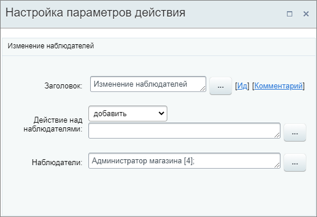

# Изменить наблюдателей

**Навигация**
- [← Оглавление курса](index.md)
- [← Предыдущий: 20766 — Изменить контакт](lesson_20766.md)
- [Следующий: 8539 — Изменить ответственного →](lesson_8539.md)

Официальная страница урока: https://dev.1c-bitrix.ru/learning/course/index.php?COURSE_ID=57&LESSON_ID=20768

Действие изменяет или добавляет наблюдателей в карточку элемента.

#### Описание параметров

- **Действие над наблюдателями** – выберите из списка, что необходимо выполнить: добавить, заменить или удалить;
- **Наблюдатели** – укажите пользователя или группу пользователей, попадающих под действие.

Пример настройки: добавление в качестве

			наблюдателя в сделке

                    Права доступа в CRM часто настроены таким образом, что менеджеры видят только свои элементы CRM. Но бывают ситуации, когда надо видеть лиды или сделки других сотрудников и участвовать в обсуждении вопросов по клиентам. Например, ведущему менеджеру важно следить за тем, как ведет сделку стажер и помогать ему при необходимости.

Подробнее на [helpdesk.bitrix24.ru](https://helpdesk.bitrix24.ru/open/8668715/?_ga=2.174964386.1270552221.1610632076-1878480751.1590479842).

		 пользователя **Администратор магазина**.

