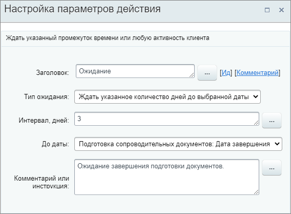

# Поставить паузу

**Навигация**
- [← Оглавление курса](index.md)
- [← Предыдущий: 28606 — Пригласить клиента в мессенджер](lesson_28606.md)
- [Следующий: 23574 — Провести автоплатёж →](lesson_23574.md)

Официальная страница урока: https://dev.1c-bitrix.ru/learning/course/index.php?COURSE_ID=57&LESSON_ID=20770

Действие включает ожидание указанного промежутка времени или любой активности клиента.

**Примечание:** Действие аналогично [ожиданию](https://helpdesk.bitrix24.ru/open/6560471/) в карточке CRM в публичной части (форма создания дел и комментариев, кнопка **Ждать**).

#### Описание параметров

- **Тип ожидания** – выберите из списка тип ожидания:

  - Ждать указанное количество дней
  - Ждать указанное количество дней до выбранной даты
- **Интервал, дней** – укажите интервал ожидания в днях;
- **До даты** – выберите из списка доступных дат ту дату, до которой будет установлено ожидание (если ранее не произойдет
  			активности клиента
                      Допустим, Вы выбрали опцию Ждать 2 дня. Т.е. Битрикс24 установит для элемента CRM (например, Сделки) ожидание на 2 дня. Но оно автоматически прекратится раньше срока, если Клиент совершит какую-нибудь активность – к примеру, напишет письмо или позвонит.
  		);
- **Комментарий или инструкция** – необязательное текстовое поле для комментария или инструкции. При необходимости, заполните его вручную или с помощью формы
  			Вставка значения
                      При работе с бизнес-процессом в параметрах действий, параметрах шаблона и настройках статуса есть возможность указывать как собственный текст (заданный вручную), так и использовать различные переменные значения (поля документа и прочие данные, которые могут меняться и поэтому не задаются вручную). Для подстановки таких переменных значений используется специальная форма **Вставка значения**.
  [Подробнее](lesson_12383.md)...
  		.

Пример настройки:

