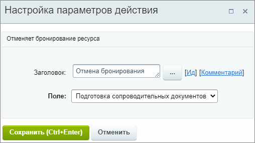

# Отменить бронирование

**Навигация**
- [← Оглавление курса](index.md)
- [← Предыдущий: 9007 — Ожидание статуса лида](lesson_9007.md)
- [Следующий: 9009 — Отправить СМС →](lesson_9009.md)

Официальная страница урока: https://dev.1c-bitrix.ru/learning/course/index.php?COURSE_ID=57&LESSON_ID=20772

Действие удаляет бронирование.

**Примечание:** Действие аналогично отмене [бронирования ресурсов](https://helpdesk.bitrix24.ru/open/7525323) в публичной части CRM.

#### Описание параметров

- **Поле** – выберите одно из существующих полей типа
  			бронирование ресурсов
                      **Бронирование ресурсов** – это тип пользовательского поля. Его можно использовать в лидах и сделках, а создать в настройках CRM или карточке элемента.
  Подробнее на [helpdesk.bitrix24.ru](https://helpdesk.bitrix24.ru/open/7525323).
  		.

Пример настройки:

