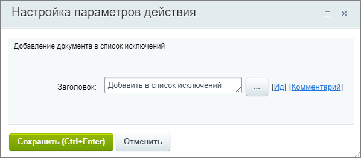

# Добавить клиента в список исключений

**Навигация**
- [← Оглавление курса](index.md)
- [← Предыдущий: 8535 — Добавить клиента в рекламную аудиторию Вконтакте](lesson_8535.md)
- [Следующий: 20760 — Добавить комментарий в элемент →](lesson_20760.md)

Официальная страница урока: https://dev.1c-bitrix.ru/learning/course/index.php?COURSE_ID=57&LESSON_ID=20774

Действие вносит клиента в список исключений, чтобы при повторном обращении элемент CRM с ним не создавался. Подробнее о списке исключений на [helpdesk.bitrix24.ru](https://helpdesk.bitrix24.ru/open/7362845).

Действие не имеет настроек, кроме стандартного заголовка.

