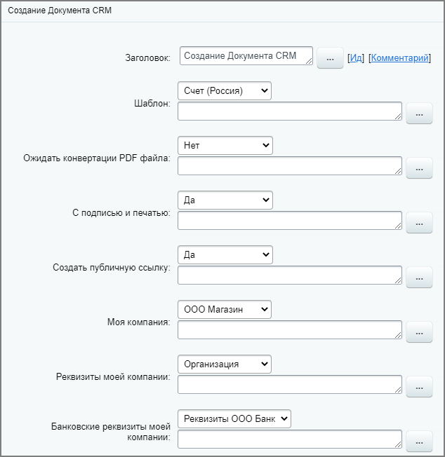
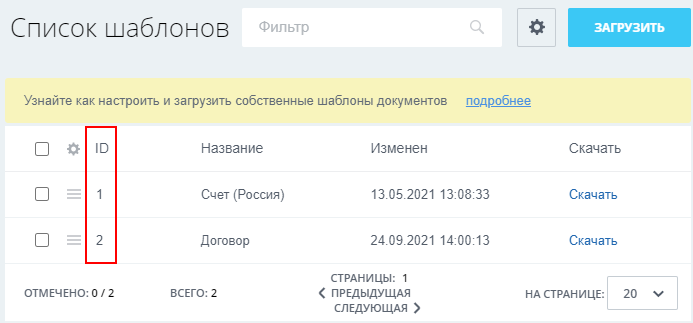
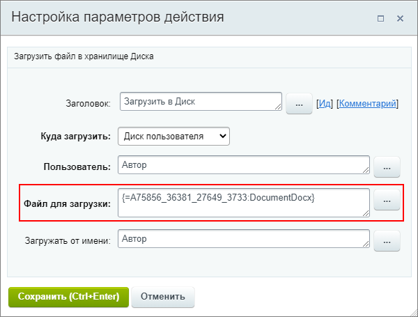
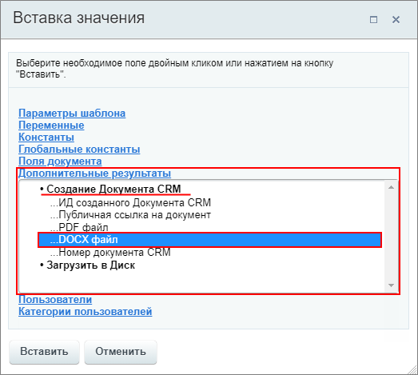

# Создать документ

**Навигация**
- [← Оглавление курса](index.md)
- [← Предыдущий: 3775 — Создание новой сделки](lesson_3775.md)
- [Следующий: 20824 — Создать Контакт к Лиду →](lesson_20824.md)

Официальная страница урока: https://dev.1c-bitrix.ru/learning/course/index.php?COURSE_ID=57&LESSON_ID=20776

Действие создаёт документ на основании шаблона. Например, счет или коммерческое предложение.

**Примечание:** О работе с документами CRM читайте на [helpdesk.bitrix24.ru](https://helpdesk.bitrix24.ru/open/7642121)

### Описание параметров

- **Шаблон** – укажите шаблон, по которому будет создан документ;
- **Ожидать конвертации PDF файла** – если выбрано **Да**, то действие не будет завершено пока не выполнится конвертация документа в формате PDF;
- **С подписью и печатью** – добавлять в документ подпись и печать (должны быть ранее указаны в настройках вашей компании);
- **Создать публичную ссылку** – создастся публичная ссылка (т.е. созданный документ будет доступен для скачивания извне по ссылке);
- **Моя компания** – укажите свою компанию;
- **Реквизиты моей компании** – укажите реквизиты вашей компании;
- **Банковские реквизиты моей компании** – укажите банковские реквизиты вашей компании;
- **Поля документа** &gt; **Добавить поле** – добавление
  			пользовательских полей
                      Пример добавления в статье на [helpdesk.bitrix24.ru](https://helpdesk.bitrix24.ru/open/15535158/).
  		 для документа.

**Примечание:**

- Как создать свою компанию и заполнить реквизиты читайте в статье [Как добавить реквизиты своей компании?](https://helpdesk.bitrix24.ru/open/2025947)
- А о том, как настроить наименование файла, создаваемого по шаблону документа, в статье [Нумераторы](https://helpdesk.bitrix24.ru/open/7486453/)

Пример настройки:

**Важно:** Для параметров действия **Шаблон**, **Реквизиты ...** и **Банковские реквизиты ...** доступна подстановка значений через форму

			«Вставка значения»

                    При работе с бизнес-процессом в параметрах действий, параметрах шаблона и настройках статуса есть возможность указывать как собственный текст (заданный вручную), так и использовать различные переменные значения (поля документа и прочие данные, которые могут меняться и поэтому не задаются вручную). Для подстановки таких переменных значений используется специальная форма **Вставка значения**.

[Подробнее](lesson_12383.md)...

		, но нужно иметь ввиду два момента:

- В качестве значений действию нужны идентификаторы
  			ID
                      Например для шаблона документов идентификаторы можно посмотреть на странице списка шаблонов.
  Подробнее на [helpdesk.bitrix24.ru](https://helpdesk.bitrix24.ru/open/7622241/).
  
  		 этих элементов;
- В основном списке вариантов параметра должно быть выбрано **Не установлено**.

Сгенерированные документы доступны в той сущности CRM, в которой был запущен бизнес-процесс, а также хранятся в скрытой папке

			Документы CRM

                    Папка скрытая. Её содержимое можно посмотреть в [экспертном режиме Очистки диска](https://helpdesk.bitrix24.ru/open/6479945).

		 на **Общем диске**.

### Результаты выполнения действия

Результаты выполнения этого действия можно получить с помощью формы **Вставка значения** – **Дополнительные результаты**, в которой они будут доступны  сразу после добавления действия в шаблон.

Доступно:

- Идентификатор созданного документа;
- Публичная ссылка на документ;
- PDF файл;
- DOCX файл;
- Номер документа CRM.

Пример использования такого результата: добавление файла DOCX в действии

			Загрузить в Диск

                    Действие загружает файл в хранилище Диска.
[Подробнее](lesson_7727.md)...

		.

