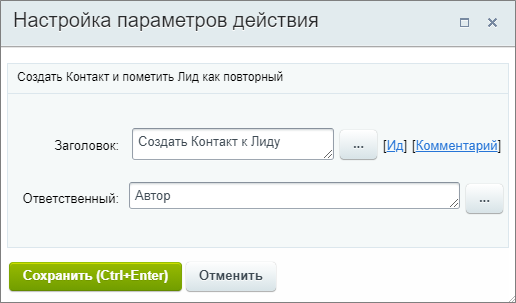
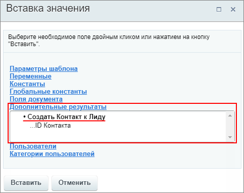

# Создать Контакт к Лиду

**Навигация**
- [← Оглавление курса](index.md)
- [← Предыдущий: 20776 — Создать документ](lesson_20776.md)
- [Следующий: 8541 — Создать на основании →](lesson_8541.md)

Официальная страница урока: https://dev.1c-bitrix.ru/learning/course/index.php?COURSE_ID=57&LESSON_ID=20824

Действие создаёт Контакт и помечает Лид как

			повторный

                    Получайте постоянных клиентов и повышайте лояльность с повторными лидами в Битрикс24.

Подробнее читайте на [helpdesk.bitrix24.ru](https://helpdesk.bitrix24.ru/open/7292839)

		.

#### Описание параметров

- **Ответственный** – назначьте пользователя, ответственного за создаваемый Контакт.

Пример настройки:

В результате выполнения действия в секции **Дополнительные результаты** формы

			«Вставка значения»

                    При работе с бизнес-процессом в параметрах действий, параметрах шаблона и настройках статуса есть возможность указывать как собственный текст (заданный вручную), так и использовать различные переменные значения (поля документа и прочие данные, которые могут меняться и поэтому не задаются вручную). Для подстановки таких переменных значений используется специальная форма **Вставка значения**.

[Подробнее](lesson_12383.md)...

		 станет доступен ID нового Контакта:

