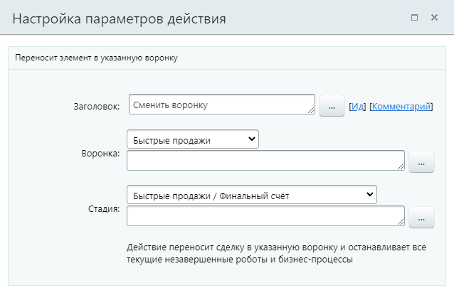

# Сменить воронку

**Навигация**
- [← Оглавление курса](index.md)
- [← Предыдущий: 23574 — Провести автоплатёж](lesson_23574.md)
- [Следующий: 9011 — Сменить стадию →](lesson_9011.md)

Официальная страница урока: https://dev.1c-bitrix.ru/learning/course/index.php?COURSE_ID=57&LESSON_ID=20826

Действие переносит элемент в указанную воронку продаж и останавливает все текущие незавершенные роботы и бизнес-процессы. Подробнее о воронках продаж читайте на [helpdesk.bitrix24.ru](https://helpdesk.bitrix24.ru/open/12048924).

**Примечание**: ранее действие имело название Сменить направление

#### Описание параметров

- **Воронка** – выберите нужный вариант из списка или укажите его через форму
  			«Вставка значения»
                      При работе с бизнес-процессом в параметрах действий, параметрах шаблона и настройках статуса есть возможность указывать как собственный текст (заданный вручную), так и использовать различные переменные значения (поля документа и прочие данные, которые могут меняться и поэтому не задаются вручную). Для подстановки таких переменных значений используется специальная форма **Вставка значения**.
  [Подробнее](lesson_12383.md)...
  		;
- **Стадия** – выберите стадию из списка или укажите её через форму «Вставка значения». В списке отображены стадии выбранной воронки.

Пример:

