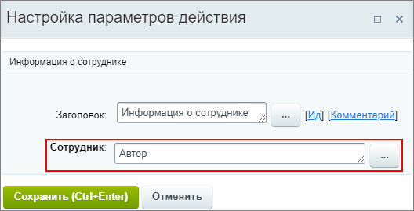
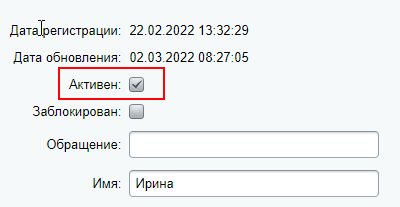
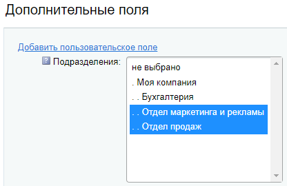

# Получить информацию о сотруднике

**Навигация**
- [← Оглавление курса](index.md)
- [← Предыдущий: 25792 — Пауза робота](lesson_25792.md)
- [Следующий: 3813 — Прерывание процесса →](lesson_3813.md)

Официальная страница урока: https://dev.1c-bitrix.ru/learning/course/index.php?COURSE_ID=57&LESSON_ID=20828

Действие получает данные о сотруднике для использования в других действиях.

### Описание параметров

- **Сотрудник** – укажите пользователя, информацию о котором требуется получить.

Например:

Полученные данные о пользователе будут доступны для выбора в других действиях в секции **Дополнительные результаты** формы **Вставка значения**:

### Подробнее о дополнительных результатах

Бо́льшая часть доп. результатов – это информация из

			карточки пользователя

                    Управление учетными записями пользователей в системе выполняется на странице **Список пользователей** (Настройки &gt; Пользователи &gt; Список пользователей).

Подробнее в курсе [Администратор. Базовый](https://dev.1c-bitrix.ru/learning/course/index.php?COURSE_ID=35&LESSON_ID=2004).

		. Ниже приведен полный список дополнительных результатов (*для некоторых из них даны пояснения во всплывающей информации*):

- Активен
                      Информация об активности учетной записи пользователя
  в формате **Y/N**.
  
- E-mail
- Рабочий телефон
- Мобильный телефон
- Внутренний телефон
- Логин
- Фамилия
- Имя
- Отчество
- Должность
- Дата рождения
- Сайт
- Город
- Skype
- Twitter
- Facebook*
- LinkedIn
- Xing
- Другие сайты
- Отсутствует (по графику отсутствий)
                      Возвращает факт отсутствия в формате **Y/N** (Да/Нет). Информация берется из [графика отсутствий](https://helpdesk.bitrix24.ru/open/5349195/). Например, если пользователь в отпуске, то результатом будет **Y** (Да).
- Статус рабочего дня
                      Возвращает статус [рабочего дня](https://helpdesk.bitrix24.ru/open/5355941/):
  **CLOSED** – закрыт;
  **OPENED** – открыт;
  **PAUSED** – пауза.
- Подразделение (список ID)
                      Возвращает список идентификаторов ID всех подразделений,
  в которых состоит пользователь. Например в виде: **2, 3**.
  
  Подразделения являются разделами инфоблока. Подробнее
  в уроке [Структура компании](https://dev.1c-bitrix.ru/learning/course/index.php?COURSE_ID=48&LESSON_ID=2777) курса Администратор сервиса
  Битрикс24 (коробочная версия).
- Подразделение (названия)
- Руководитель
                      Если руководителей несколько, то вернет всех.

**Примечание**: Все указанные выше поля есть по умолчанию в штатной версии *Битрикс24 в коробке*. Если вы не находите в карточке пользователя указанные поля, проверьте

			настройки формы

                    При работе с товарами, материалами статей, каталогами справочников зачастую в форме присутствуют поля, которые не используются на сайте. Лишние поля увеличивают размеры формы редактирования и затрудняют внесение данных. Облегчите свой труд, используйте инструмент настройки форм инфоблоков.

Подробнее в курсе [Контент-менеджер](https://dev.1c-bitrix.ru/learning/course/index.php?COURSE_ID=34&LESSON_ID=1883).

		. Вероятно, эти поля скрыты из формы.

В штатной *1С-Битрикс: Управление сайтом* в карточке пользователя есть только

			часть полей

                    Отсутствуют все поля до конца списка начиная от Skype.

		 из дополнительных результатов действия.

* Социальная сеть признана экстремистской и запрещена на территории Российской Федерации.
