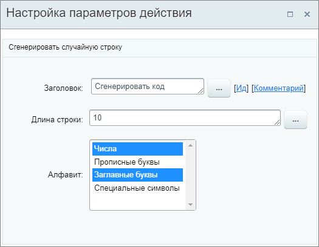
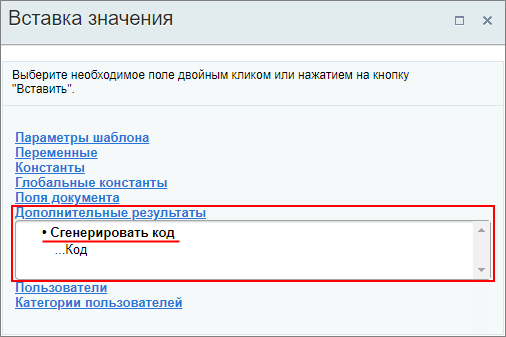

# Сгенерировать код

**Навигация**
- [← Оглавление курса](index.md)
- [← Предыдущий: 3813 — Прерывание процесса](lesson_3813.md)
- [Следующий: 7397 — Создание группы →](lesson_7397.md)

Официальная страница урока: https://dev.1c-bitrix.ru/learning/course/index.php?COURSE_ID=57&LESSON_ID=20830

Действие сгенерирует случайную строку.

#### Описание параметров

- **Длина строки** – укажите необходимое количество символов в строке;
- **Алфавит** – выберите из чего необходимо сгенерировать строку. Доступен множественный выбор с помощью зажатия клавиши **Ctrl**. В списке четыре вида алфавита:

  - **Числа**;
  - **Прописные буквы**;
  - **Заглавные буквы**;
  - **Специальные символы**.

Пример настройки:

Примеры сгенерированных комбинаций для строки длиной `10` символов:

| \| **Алфавит** \| **Пример сгенерированного кода** \| \| --- \| --- \| \| Числа \| 8584643630 \| \| Прописные буквы \| rkqldugmmy \| \| Заглавные буквы \| TPSHUMDRNP \| \| Специальные символы \| @[_+;(*#@) \| \| ЧислаЗаглавные буквы \| EYQFV5I5IK \| \| ЧислаПрописные буквыЗаглавные буквыСпециальные символы \| 1eHdUz{3@F \| |
| --- |

Сгенерированный код будет в дальнейшем доступен для выбора в секции **Дополнительные результаты** формы **Вставка значения** в других действиях:

