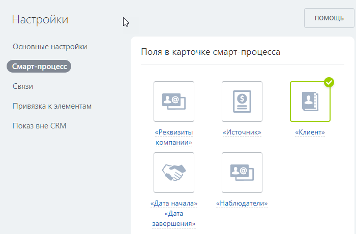
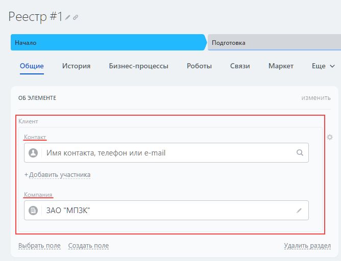
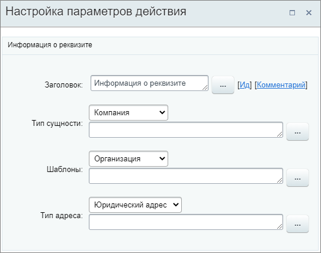

# Получить информацию о реквизитах

**Навигация**
- [← Оглавление курса](index.md)
- [← Предыдущий: 23592 — Получить информацию о привязанном элементе](lesson_23592.md)
- [Следующий: 23568 — Получить информацию о товарной позиции →](lesson_23568.md)

Официальная страница урока: https://dev.1c-bitrix.ru/learning/course/index.php?COURSE_ID=57&LESSON_ID=20858

Действие получает информацию о реквизитах контакта или компании для передачи в другие действия.

В бизнес-процессах Контакта / Компании действие получит информацию о реквизитах той сущности, в которой запущен БП. В бизнес-процессах остальных сущностей CRM – реквизиты связанного контакта / компании.

#### Описание параметров

- **Тип сущности** – выберите откуда необходимо получить информацию о реквизитах. Этот параметр не отображается, если действие используется в бизнес-процессе Контакта или Компании;
- **Шаблоны** – укажите
  			шаблон реквизитов
                      Шаблон реквизитов - это подготовленный набор полей, который вы можете вставить в документ одним кликом.
  Подробнее читайте на [helpdesk.bitrix24.ru](https://helpdesk.bitrix24.ru/open/7385595).
  		: организация, ИП или физ. лицо;
- **Тип адреса** – укажите тип адреса из реквизитов.

Действие не вернет информацию о реквизитах, если шаблон или тип адреса не совпадут с реквизитами контакта / компании.

Есть особенности работы действия в смарт-процессах. Важно верно настроить смарт-процесс, чтобы действие смогло получить реквизиты. Подробнее в спойлере:

## Как настроить смарт-процесс?

В [настройках смарт-процесса](https://helpdesk.bitrix24.ru/open/13315798/) должны быть включены следующие основные настройки:

- Использовать в смарт-процессе свои стадии и канбан;
- Использовать в смарт-процессе роботы и триггеры;
- Использовать в смарт-процессе дизайнер бизнес-процессов.

А также активировано поле

			Клиент

                    

		 в карточке смарт-процесса.

Теперь, в карточке добавьте

			Контакт и/или Компанию

                    

		. По привязанным таким образом сущностям будет работать получение информации о реквизитах.

#### Пример

Пусть мы работаем с бизнес-процессом Сделок. С такой настройкой параметров действие получит реквизиты компании, связанной с этой сделкой, при условии, что реквизиты будут иметь шаблон Организация и Юридический адрес.

Полученные данные о реквизитах станут доступны для выбора в секции **Дополнительные результаты** формы

			«Вставка значения»

                    При работе с бизнес-процессом в параметрах действий, параметрах шаблона и настройках статуса есть возможность указывать как собственный текст (заданный вручную), так и использовать различные переменные значения (поля документа и прочие данные, которые могут меняться и поэтому не задаются вручную). Для подстановки таких переменных значений используется специальная форма **Вставка значения**.

[Подробнее](lesson_12383.md)...

		 в других действиях:

