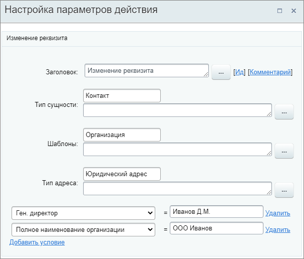

# Изменить реквизиты

**Навигация**
- [← Оглавление курса](index.md)
- [← Предыдущий: 23590 — Изменить привязанный элемент](lesson_23590.md)
- [Следующий: 23580 — Изменить элемент смарт-процесса →](lesson_23580.md)

Официальная страница урока: https://dev.1c-bitrix.ru/learning/course/index.php?COURSE_ID=57&LESSON_ID=20860

Действие изменяет или добавляет реквизиты в связанной компании или контакте.

#### Описание параметров

- **Тип сущности** – выберите из списка тип сущности: контакт или компания;
- **Шаблоны** – укажите
  			шаблон реквизитов
                      Шаблон реквизитов – это подготовленный набор полей, который вы можете вставить в документ одним кликом.
  Подробнее читайте на [helpdesk.bitrix24.ru](https://helpdesk.bitrix24.ru/open/7385595).
  		;
- **Тип адреса** – укажите тип адреса из реквизитов;
- **Поле из реквизитов** – выберите то, значение которого необходимо изменить. В поле справа укажите новое значение. С помощью кнопки **Добавить условие** добавляйте столько полей для изменения, сколько требуется.
  **Внимание:** Указать значение можно только вручную. Подстановка через форму **Вставка значения** для этих полей не предусмотрена.

Пример настройки: изменение полей **Ген. директор** и  **Полное наименование организации** в реквизитах компании, связанной со сделкой, в которой запущен бизнес-процесс.

