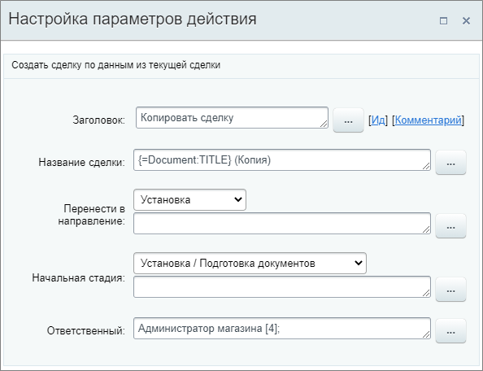
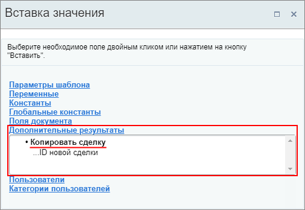

# Копировать сделку

**Навигация**
- [← Оглавление курса](index.md)
- [← Предыдущий: 23572 — Копировать или Переместить товарные позиции](lesson_23572.md)
- [Следующий: 23594 — Копировать элемент смарт-процесса →](lesson_23594.md)

Официальная страница урока: https://dev.1c-bitrix.ru/learning/course/index.php?COURSE_ID=57&LESSON_ID=20862

Действие создаёт новую сделку по данным из текущей.

#### Описание параметров

- **Название сделки** – укажите название новой сделки. По умолчанию это название текущей сделки `{=Document:TITLE}` с добавлением текста `(Копия)`;
- **Перенести в воронку** – выберите, в какую из существующих воронок перенести создаваемую сделку;
- **Начальная стадия** – укажите начальную стадию;
- **Ответственный** – назначьте пользователя, ответственного за создаваемую сделку.

**Примечание**. Если параметры «Перенести в воронку» и «Начальная стадия» не были заполнены, то они заполнятся автоматически после закрытия формы настроек (будет выбран первый вариант в списке).

Пример настройки:

В результате выполнения действия в секции **Дополнительные результаты** формы **Вставка значения** станет доступен ID новой сделки:

