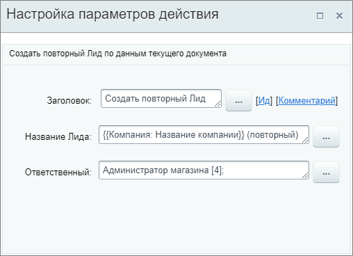
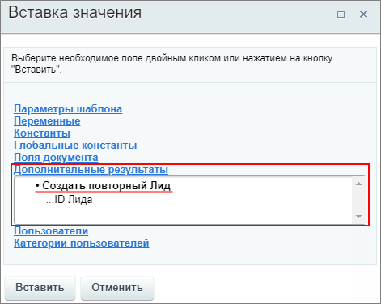

# Создать повторный Лид

**Навигация**
- [← Оглавление курса](index.md)
- [← Предыдущий: 8541 — Создать на основании](lesson_8541.md)
- [Следующий: 23576 — Создать ссылку на оплату →](lesson_23576.md)

Официальная страница урока: https://dev.1c-bitrix.ru/learning/course/index.php?COURSE_ID=57&LESSON_ID=20864

Действие создаёт

			повторный Лид

                    В большинстве случаев привлечь нового клиента сложнее, чем удержать старого, поэтому работа с постоянными клиентами очень важна. В Битрикс24 вы сразу увидите, покупал клиент что-нибудь у вас или ещё нет.

Подробнее читайте на [helpdesk.bitrix24.ru](https://helpdesk.bitrix24.ru/open/7292839)

		 по данным текущего документа. Доступно для шаблонов бизнес-процессов [Сделок](https://helpdesk.bitrix24.ru/open/5493461/), [Коммерческих предложений](https://helpdesk.bitrix24.ru/open/5450649/) и [Счетов](https://helpdesk.bitrix24.ru/open/14795982/).

#### Описание параметров

- **Название Лида** – укажите название для создаваемого Лида;
- **Ответственный** – выберите пользователя, ответственного за создаваемого Лида.

Пример настройки: название лида задается на основании названия компании в текущей сделки `{{Компания: Название компании}}` и добавления текста `(повторный)`.

В результате выполнения действия в секции **Дополнительные результаты** формы **Вставка значения** станет доступен ID Лида:

