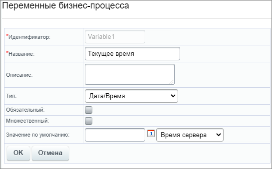
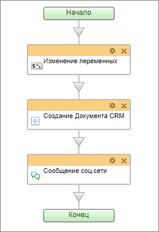
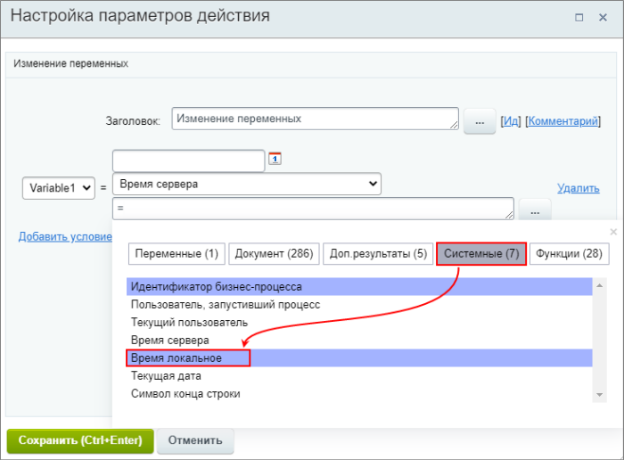
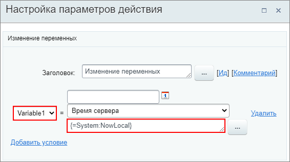
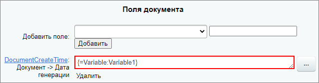
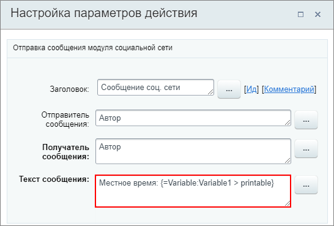

# Установка времени клиента в документе CRM

**Навигация**
- [← Оглавление курса](index.md)
- [← Предыдущий: 6851 — Утверждение документа с учетом времени](lesson_6851.md)
- [Следующий: 12305 — Техническое задание →](lesson_12305.md)

Официальная страница урока: https://dev.1c-bitrix.ru/learning/course/index.php?COURSE_ID=57&LESSON_ID=22098

В документах часто бывает необходимо указывать время клиента при его создании. По умолчанию используется время сервера. Но сервер может быть размещен в любой точке мира, иметь любой часовой пояс, а значит время на сервере может разительно отличаться от местного. Нужное время можно вычислять и подставлять с помощью бизнес-процесса.

### О примере

**Задача:** Имеется шаблон документа CRM. В документе, создаваемом по этому шаблону, требуется указание даты и времени создания документа с учетом местного часового пояса (отличается от времени на сервере).

Посмотрим простой пример, как указать местное время. Использовать будем действие

			Создание документа CRM

                    Действие создаёт документ CRM.

[Подробнее...](lesson_20776.md)

		 в бизнес-процессах Сделок и значение `{=System:NowLocal}` (текущая дата со временем клиента с учётом часового пояса).

Темы, которые затрагиваются в примере (*без знания этих тем пример может быть непонятен*):

- Битрикс24: [Документы CRM](https://helpdesk.bitrix24.ru/open/7642121/) и [Шаблоны документов](https://helpdesk.bitrix24.ru/open/7622241/);
- Битрикс24: работа со [сделками в CRM](https://helpdesk.bitrix24.ru/open/5493461/).

**Примечание:** На время также влияют настройки

			главного модуля

                    Форма Настройки модуля служит для управления глобальными настройками как сайта в целом, так и каждого модуля в отдельности.

Подробнее в [пользовательской документации](https://dev.1c-bitrix.ru/user_help/settings/settings/settings.php).

		 (Настройки &gt; Настройки продукта &gt; Настройки модулей &gt; Главный модуль, закладка **Настройки**, секция **Часовые пояса**).

### Создание шаблона БП

1. Для примера создадим специальный тестовый шаблон документа, в котором укажем одну строку с текстом и полем, куда будет подставляться время в определенном формате:
  `Время создания документа: {DocumentCreateTime~d.m.Y H:i}` (где d.m.Y H:i – форматирование даты).
  
2. Перейдем к созданию шаблона последовательного бизнес-процесса для **Сделок** (CRM &gt; Настройки &gt; Роботы и бизнес-процессы &gt; Бизнес-процессы, шаблоны для Сделок). Создадим переменную типа **Дата/время**;
  
3. Добавим три действия в шаблон:
  

  - **Изменение переменных** – укажем в форме **Вставка значения**, что значение переменной равно локальному времени через
    			список
                        
    		 или
    			вручную
                        
    		 `{=System:NowLocal}`;
    **Примечание:** в этом действии впоследствии удобно модифицировать переменную. К примеру, прибавить или убавить время / дни.
  - **Создание документа CRM** – выберем наш тестовый шаблон документа и в конце формы настроек добавим поле **DocumentCreateTime**. В качестве значения укажем переменную;
    
  - **Сообщение соц. сети** – в этом примере используем только в качестве способа вывода полного значения даты / времени для информации. Позже сверим его с отформатированным значением в созданном документе.
    
4. Шаблон БП готов. Сохраним его и перейдем к проверке. Для этого откроем любую сделку и запустим на выполнение бизнес-процесс.

### Результаты

В результате выполнения бизнес-процесса создастся документ CRM для сделки и появится уведомление. В уведомлении мы увидим полное значение даты / времени по местному времени:

В созданном документе CRM это же значение в отформатированном варианте:

