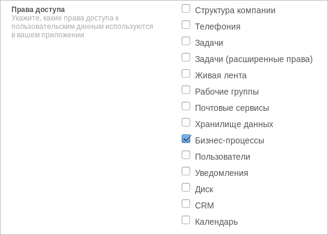
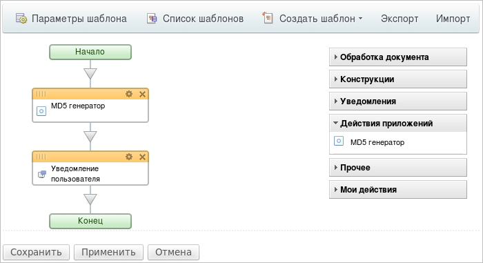
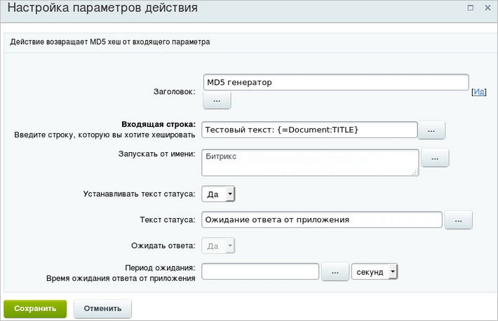
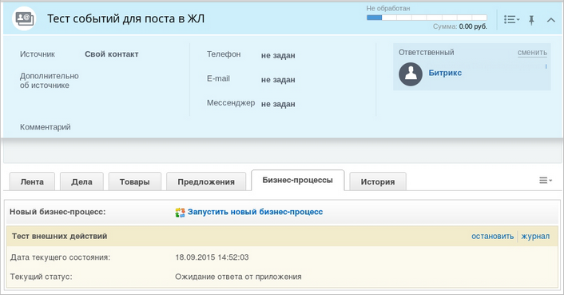
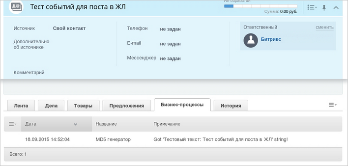
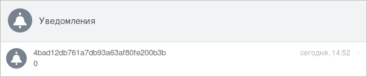
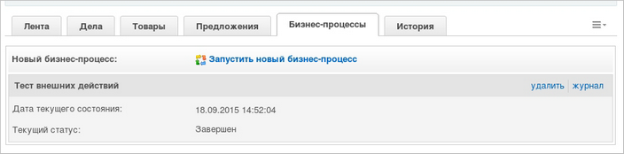

# REST в бизнес-процессах

**Навигация**
- [← Оглавление курса](index.md)
- [← Предыдущий: 5815 — Выполнение «задания» бизнес-процесса, используя API](lesson_5815.md)
- [Следующий: 7771 — Пример использования REST в процессах →](lesson_7771.md)

Официальная страница урока: https://dev.1c-bitrix.ru/learning/course/index.php?COURSE_ID=57&LESSON_ID=23036

|  | ### Используем REST |
| --- | --- |


Чтобы [приложение Битрикс24](https://dev.1c-bitrix.ru/learning/course/index.php?COURSE_ID=99) могло зарегистрировать действие в дизайнере бизнес-процессов, при загрузке нужно указать ему разрешение на работу с ними.





В это разрешение входят следующие методы:


- [bizproc.activity.add](https://dev.1c-bitrix.ru/rest_help/bizproc/bizproc_activity/add.php)
- [bizproc.activity.delete](https://dev.1c-bitrix.ru/rest_help/bizproc/bizproc_activity/delete.php)
- [bizproc.activity.list](https://dev.1c-bitrix.ru/rest_help/bizproc/bizproc_activity/list.php)
- [bizproc.activity.log](https://dev.1c-bitrix.ru/rest_help/bizproc/bizproc_activity/log.php)
- [bizproc.event.send](https://dev.1c-bitrix.ru/rest_help/bizproc/bizproc_event/send.php)


Приложение при помощи метода **bizproc.activity.add** регистрирует свое действие бизнес-процесса, которое будет отображаться во вкладке дизайнера **Действия приложений**. При этом для действия необходимо задать:


- названия и описания для разных языков,
- список входных и выходных параметров действия,
- ссылка на обработчик,
- применимость к различным типам документов,
- дополнительные параметры типа флага, предполагается ли ожидание завершения, или типа авторизации.


```
var params = {
	'CODE': 'md5',
	'HANDLER': 'http://sigurd.office.bitrix.ru/bp/ping.php',
	'AUTH_USER_ID': 1,
	'USE_SUBSCRIPTION': 'Y',
	'NAME': {
		'ru': 'MD5 генератор',
		'en': 'MD5 generator'
	},
	'DESCRIPTION': {
		'ru': 'Действие возвращает MD5 хеш от входящего параметра',
		'en': 'Activity returns MD5 hash of input parameter'
	},
	'PROPERTIES': {
		'inputString': {
			'Name': {
				'ru': 'Входящая строка',
				'en': 'Input string'
			},
			'Description': {
				'ru': 'Введите строку, которую вы хотите хешировать',
				'en': 'Input string for hashing'
			},
			'Type': 'string',
			'Required': 'Y',
			'Multiple': 'N',
			'Default': '{=Document:NAME}',
		}
	},
	'RETURN_PROPERTIES': {
		'outputString': {
			'Name': {
				'ru': 'MD5',
				'en': 'MD5'
			},
			'Type': 'string',
			'Multiple': 'N',
			'Default': null
		}
	}
};

BX24.callMethod(
	'bizproc.activity.add',
	params,
	function(result)
	{
		if(result.error())
			alert("Error: " + result.error());
		else
			alert("Успешно: " + result.data());
	}
);
```


Результат:








Когда исполняющийся бизнес-процесс, содержащий данное действие, доходит до зарегистрированного приложением действия, то совершается вызов ссылки, указанной в параметре `HANDLER`. В **POST**-данных передаются идентификатор бизнес-процесса и идентификатор действия бизнес-процесса, входные параметры действия, а также, параметры REST-авторизации. Все происходит аналогично вызовам обработчиков событий.


Пример входных данных:


```
array(
	'workflow_id' => '55c1dc1c3f0d75.78875596',
	'event_token' => '55c1dc1c3f0d75.78875596|A51601_82584_96831_81132|hsyUws1j4XiwqPqN45eH66CcQtEvpUIP.47dd5d888e8e549d2c984713e12a4268e6e87d0208ca1f093ba1075e77f92e90'
	'code' => 'md5',
	'properties' => array(
		'inputString' => 'Тестовый текст: Тест событий для поста в ЖЛ',
	),
	'auth' => array(
		'access_token' => '2irn0939uscuk7xxacc8tgn7vyjs4xn3',
		'expires_in' => '3600',
		'scope' => 'bizproc,user',
		'user_id' => '1',
		'status' => 'L',
		'member_id' => 'd41d8cd98f00b204e9800998ecf8427e',
		'domain' => 'b24.sigurd.bx',
	),
	'ts' => '1442580723',
)
```


Затем бизнес-процесс либо продолжается, либо останавливается и ждет ответа от приложения. Это зависит от настроек действия.


Приложение должно сообщить бизнес-процессу результат своей работы и дать сигнал, что можно продолжать бизнес-процесс дальше. Делается это при помощи метода **bizproc.event.send**, которому передаются значения выходных параметров, заданных в описании действия, а также, информация для записи в лог бизнес-процесса. Пока приложение не сообщило ответ на свое действие, оно может записывать информацию в лог процесса при помощи метода **bizproc.activity.log**.


В следующем примере содержится код простейшего обработчика, возвращающего бизнес-процессу **md5** от полученной строки:


```
<?php
file_put_contents(dirname(__FILE__)."/db/log.log", date('c').": ".var_export($_REQUEST, 1)."\n", FILE_APPEND);

if(is_array($_REQUEST["auth"]) && isset($_REQUEST["auth"]["access_token"]))
{
	$portal = $_REQUEST["auth"]["domain"];

	$requestValue = $_REQUEST["properties"]["inputString"];
	$responseValue = md5($requestValue);

	$c = curl_init("http://" . $portal . "/rest/bizproc.event.send.json");

	$params = array(
		"auth" => $_REQUEST["auth"]["access_token"],
		"event_token" => $_REQUEST["event_token"],
		"log_message" => "Got '".$requestValue."' string!",
		"return_values" => array(
			"outputString" => $responseValue,
		)
	);

	curl_setopt($c, CURLOPT_RETURNTRANSFER, true);
	curl_setopt($c, CURLOPT_HEADER, true);
	curl_setopt($c, CURLINFO_HEADER_OUT, true);
	curl_setopt($c, CURLOPT_VERBOSE, true);
	curl_setopt($c, CURLOPT_POST, true);
	curl_setopt($c, CURLOPT_POSTFIELDS, http_build_query($params));

	$response = curl_exec($c);

	file_put_contents(dirname(__FILE__)."/db/log.log", "response: ".$response."\n", FILE_APPEND);
}
```


В самом процессе это выглядит следующим образом:














**Внимание**! При удалении и при обновлении приложения все действия, связанные с приложением, удаляются!
