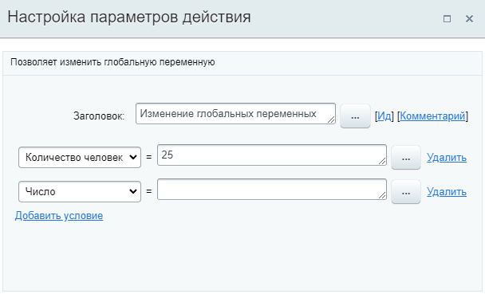

# Изменение глобальных переменных

**Навигация**
- [← Оглавление курса](index.md)
- [← Предыдущий: 3810 — Запись в отчет](lesson_3810.md)
- [Следующий: 3812 — Изменение переменных →](lesson_3812.md)

Официальная страница урока: https://dev.1c-bitrix.ru/learning/course/index.php?COURSE_ID=57&LESSON_ID=23418

Действие позволяет изменить значения

			глобальных переменных

                    Глобальные переменные используются для хранения данных и могут быть изменены. Доступны сразу во всех шаблонах бизнес-процессов.

[Подробнее](lesson_23718.md)...

		. Доступно с версии **21.500.0** модуля Бизнес-процессы и версии **21.300.0** модуля Дизайнер бизнес-процессов.

#### Описание Параметров

**Примечание:** Действие аналогично действию

			Изменение переменных

                    Действие позволяет изменить значения переменных, заданных в настройках шаблона.

[Подробнее](lesson_3812.md)...

		. Все нюансы и особенности описанные для него, актуальны и для действия **Изменение глобальных переменных**.

В выпадающем списке выбирается глобальная переменная и устанавливается необходимое значение. Значение указывается вручную или с помощью формы

			«Вставка значения»

                    При работе с бизнес-процессом в параметрах действий, параметрах шаблона и настройках статуса есть возможность указывать как собственный текст (заданный вручную), так и использовать различные переменные значения (поля документа и прочие данные, которые могут меняться и поэтому не задаются вручную). Для подстановки таких переменных значений используется специальная форма **Вставка значения**.

[Подробнее](lesson_12383.md)...

		.

По кнопке **Добавить условие** добавляется новая строка для изменения глобальной переменной. Таким образом можно изменить несколько глобальных переменных в одном действии.

