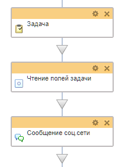
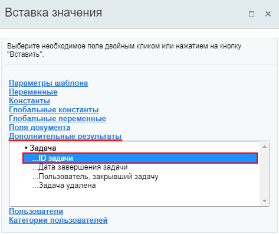
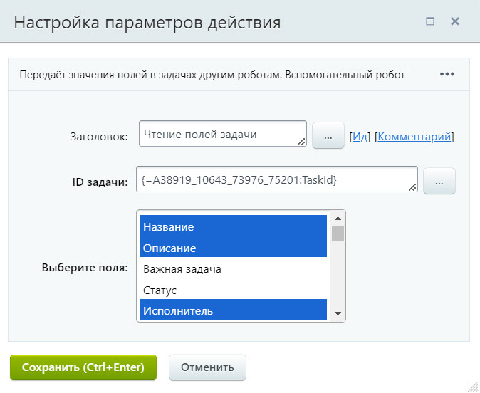
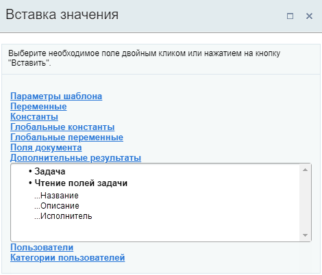
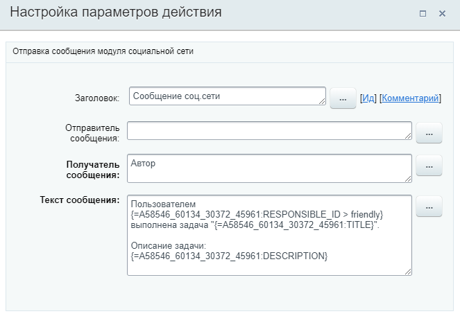

# Получить информацию о задаче

**Навигация**
- [← Оглавление курса](index.md)
- [← Предыдущий: 20748 — Изменить элемент списка](lesson_20748.md)
- [Следующий: 20750 — Получить информацию об элементе списка →](lesson_20750.md)

Официальная страница урока: https://dev.1c-bitrix.ru/learning/course/index.php?COURSE_ID=57&LESSON_ID=23424

Действие позволяет получить значения полей указанной

			задачи

                    Главный инструмент для планирования и регулирования работ внутри компании - это **Задачи**. Битрикс24.Задачи и проекты помогают работать вместе и успевать вовремя. Если задача поставлена в Битрикс24, она обязательно будет выполнена.
Ставьте задачи себе и коллегам, организуйте их выполнение и планируйте крайние сроки.

Подробнее на [helpdesk.bitrix24.ru](https://helpdesk.bitrix24.ru/section/90967/#section90961).

		 и использовать их в других действиях бизнес-процесса.

**Примечание**: Действие относится к модулю **Задачи**. Доступно только в Битрикс24 c версии **21.600.0**.

### Описание параметров

- **ID задачи** – укажите идентификатор задачи, для которой необходимо получить значения полей. Например, это может быть идентификатор задачи, ранее созданной в этом же шаблоне бизнес-процесса действием
  			Задача
                      Действие позволяет создать задачу.
  [Подробнее](lesson_3805.md)...
  		;
- **Выберите поля** – выберите поля задачи, значения которых необходимо получить. Для выбора нескольких полей зажмите клавишу **Ctrl** на клавиатуре и кликайте левой кнопкой мыши на поля.
  **Примечание:** Список полей содержит как штатные поля задачи, так и
  			пользовательские поля
                      Пользовательское поле позволяет добавлять к задаче информацию, специфическую для вашей компании. Вы можете самостоятельно подстроить задачи под себя таким образом, чтобы они отражали всю суть выполняемых работ.
  Подробнее на [helpdesk.bitrix24.ru](https://helpdesk.bitrix24.ru/open/2573061/).
  		. Ниже, в спойлере, приведен список всех штатных полей задачи, доступных в действии. Остальные поля будут являться пользовательскими, назначение которых вы можете уточнить в своей компании (например, у администратора портала).
  ## Список штатных полей задачи, доступных в действии.
  Список полей соответствует полям карточки задачи в Битрикс24. Подробнее о настройках задач вы найдете информацию на [helpdesk.bitrix24.ru](https://helpdesk.bitrix24.ru/open/1412212/).
  - ID
  - Название
  - Описание
  - Важная задача
  - Статус
  - Исполнитель
  - Дата начала
  - Длительность
  - Затраченное время
  - Плановые трудозатраты
  - Крайний срок
  - Дата начала (план)
  - Дата завершения (план)
  - Просрочена
  - Постановщик
  - Дата создания
  - Кто изменил
  - Кто закрыл
  - Дата закрытия
  - Оценка
  - Разрешена смена крайнего срока
  - Разрешен учет времени
  - Учитывать рабочее время
  - Принять после завершения
  - Добавлено в отчет
  - Группа (Проект) ID
  - Группа (Проект) (текст)
  - ID главной Задачи
  - Соисполнители
  - Наблюдатели
  - Теги
  - Результат
                        С версии **22.400.0** модуля Бизнес-процессы.
  - Результат (последний)
                        С версии **22.400.0** модуля Бизнес-процессы.
  Выбранные значения полей станут доступны для использования в секции **Дополнительные результаты** формы
  			Вставка значения
                      При работе с бизнес-процессом в параметрах действий, параметрах шаблона и настройках статуса есть возможность указывать как собственный текст (заданный вручную), так и использовать различные переменные значения (поля документа и прочие данные, которые могут меняться и поэтому не задаются вручную). Для подстановки таких переменных значений используется специальная форма **Вставка значения**.
  [Подробнее](lesson_12383.md)...
  		.

### Пример

Допустим в шаблоне бизнес-процесса создаётся новая задача с помощью действия

			Задача

                    Действие позволяет создать задачу.

[Подробнее](lesson_3805.md)...

		. И далее, после выполнения задачи исполнителем, мы хотим получить определенную информацию о выполненной им задаче и отправить её автору БП уведомлением. Описанная часть бизнес-процесса может выглядеть так:

С помощью действия **Получить информацию о задаче** получим название созданной задачи, описание и исполнителя.

			ID задачи

                    ID созданной задачи хранится в дополнительных результатах.

		 укажем с помощью формы Вставка значения.

Теперь значение этих полей тоже станут доступны в форме Вставка значения:

А значит можно их добавить в другое действие. Например, как указано в задаче, отправить уведомление с помощью действия

			Сообщение соц.сети

                    Действие отправляет уведомление модуля социальной сети.

[Подробнее](lesson_3804.md)...

		:

> **Совет**: Не забывайте использовать
>
> 			модификаторы
>
>
>
>                     Указанные нами параметры, переменные шаблона или поля документа возможно модифицировать с помощью специальных **модификаторов**, которые преобразуют данные.
>
> [Подробнее](lesson_12407.md)...
>
>
>
> 		 для преобразования значений в подходящий вам или читаемый вид.
