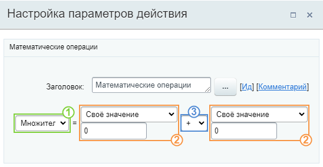
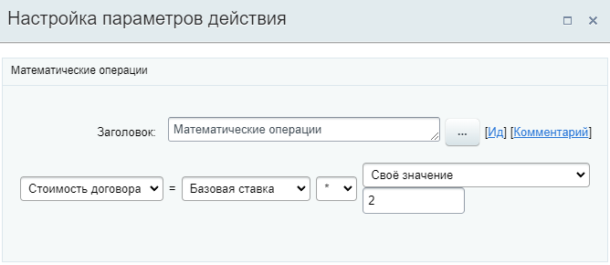

# Выполнить математические операции

**Навигация**
- [← Оглавление курса](index.md)
- [← Предыдущий: 3809 — Выбор сотрудника](lesson_3809.md)
- [Следующий: 26984 — Добавить участников в групповой чат →](lesson_26984.md)

Официальная страница урока: https://dev.1c-bitrix.ru/learning/course/index.php?COURSE_ID=57&LESSON_ID=23564

Действие позволяет выполнять математические операции со значениями переменных: сложение, вычитание, умножение, деление. Доступно с версии **21.600.0** модуля Бизнес-процессы.

#### Описание Параметров

- 1 – укажите
  			глобальную переменную
                      На контекстной панели визуального конструктора расположены две кнопки: Глобальные переменные и Глобальные константы. По нажатии на кнопку открывается слайдер со списком глобальных переменных или констант соответственно.
  [Подробнее](lesson_23718.md)...
  		, в которую будет записан результат математической операции;
- 2 – выберите из списка или укажите своё значение (число) для составляющей математической операции. В списке доступны для выбора глобальные переменные / константы и поля документа, в котором запущен бизнес-процесс;
- 3 – выберите математическую операцию: сложение, вычитание, умножение или деление.

**Важно!** Действие работает только со значениями типа **Число** или **Целое число**. Поэтому в параметрах для выбора доступны только значения из перечисленных типов.

#### Пример

В примере мы умножаем значение глоб. переменной **Базовая ставка** на число **2** (своё значение) и сохраняем результат в глоб. переменную **Стоимость договора**.
