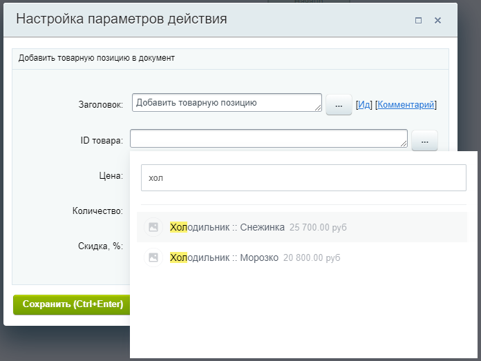
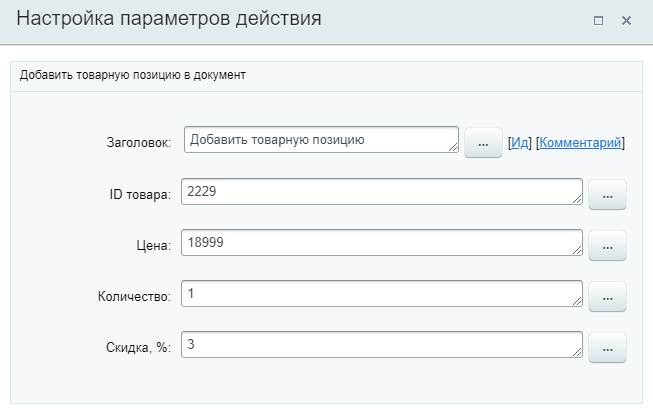

# Добавить товарную позицию

**Навигация**
- [← Оглавление курса](index.md)
- [← Предыдущий: 20760 — Добавить комментарий в элемент](lesson_20760.md)
- [Следующий: 20762 — Забронировать ресурс →](lesson_20762.md)

Официальная страница урока: https://dev.1c-bitrix.ru/learning/course/index.php?COURSE_ID=57&LESSON_ID=23566

Действие добавляет нужную

			товарную позицию

                    В карточках лидов, сделок и предложений товары находятся в отдельной вкладке.

Подробнее на [helpdesk.bitrix24.ru](https://helpdesk.bitrix24.ru/open/13216242/)

		 в элемент.

**Примечание.** Действие доступно в шаблонах бизнес-процессов [Сделок](https://helpdesk.bitrix24.ru/open/5493461/), [Коммерческих предложений](https://helpdesk.bitrix24.ru/open/5450649/), [Счетов](https://helpdesk.bitrix24.ru/open/14795982/) и [Смарт-процессов](https://helpdesk.bitrix24.ru/open/13315798/).

#### Описание параметров

- **ID товара** – укажите ID товара. Доступен выбор из
  			списка товаров
                      
  		. При выборе товара из списка товаров, в поле подставится ID в виде числа;
- **Цена** – цена товарной позиции;
- **Количество** – количество экземпляров товарной позиции;
- **Скидка, %** – величина скидки в процентах, которую нужно применить к указанной товарной позиции.

Для всех параметров доступна подстановка через форму

			Вставка значения

                    При работе с бизнес-процессом в параметрах действий, параметрах шаблона и настройках статуса есть возможность указывать как собственный текст (заданный вручную), так и использовать различные переменные значения (поля документа и прочие данные, которые могут меняться и поэтому не задаются вручную). Для подстановки таких переменных значений используется специальная форма **Вставка значения**.

[Подробнее](lesson_12383.md)...

		.

#### Пример настройки:

