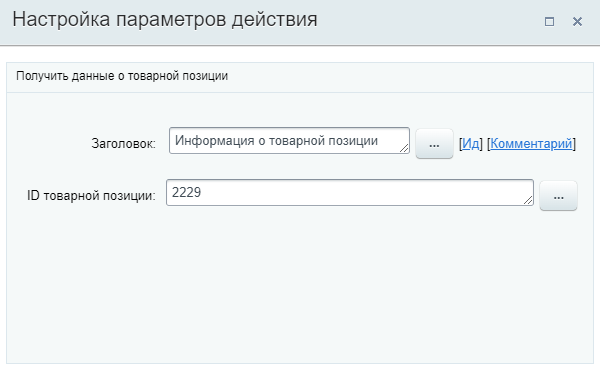
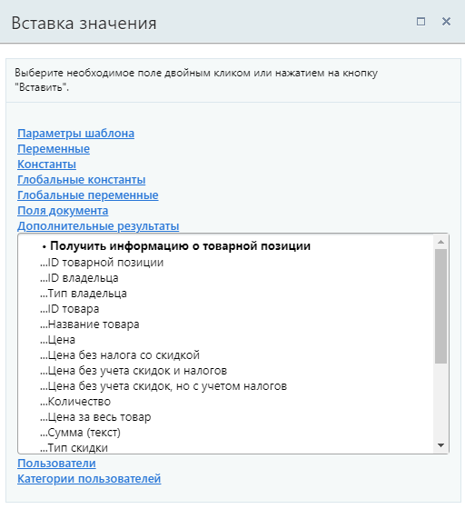
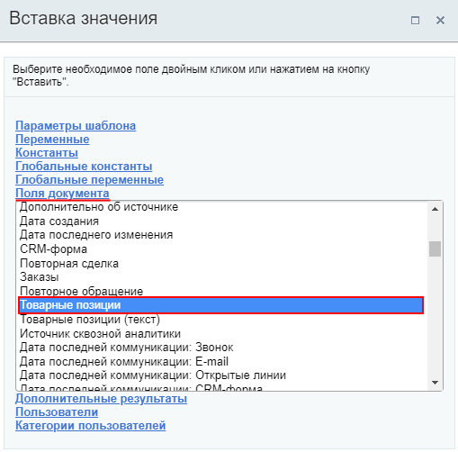
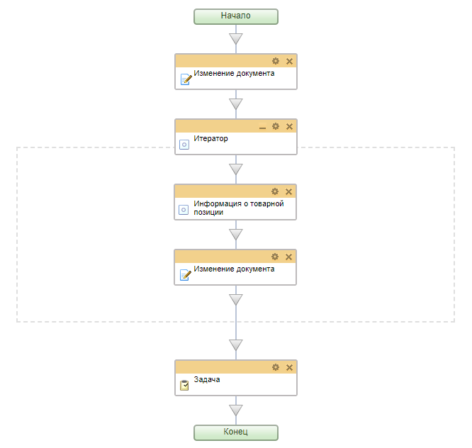
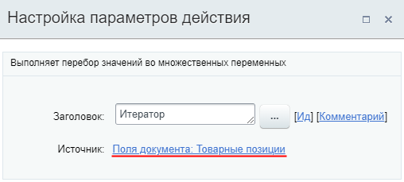
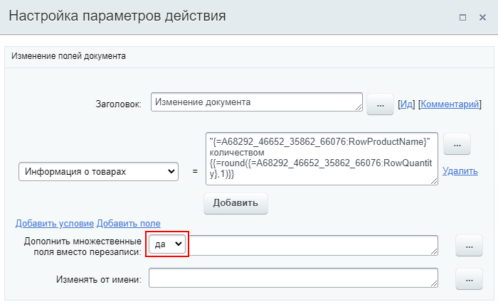
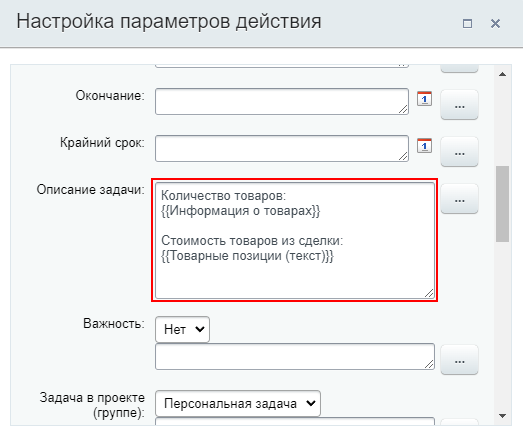
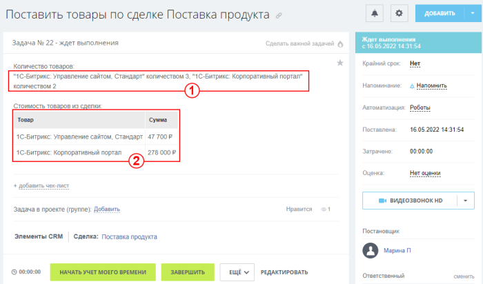

# Получить информацию о товарной позиции

**Навигация**
- [← Оглавление курса](index.md)
- [← Предыдущий: 20858 — Получить информацию о реквизитах](lesson_20858.md)
- [Следующий: 23570 — Получить информацию об оплате →](lesson_23570.md)

Официальная страница урока: https://dev.1c-bitrix.ru/learning/course/index.php?COURSE_ID=57&LESSON_ID=23568

Действие позволяет получить данные о товарной позиции для передачи в другие действия.

**Примечание:** Действие доступно в шаблонах бизнес-процессов [Сделок](https://helpdesk.bitrix24.ru/open/5493461/), [Коммерческих предложений](https://helpdesk.bitrix24.ru/open/5450649/), [Счетов](https://helpdesk.bitrix24.ru/open/14795982/) и [Смарт-процессов](https://helpdesk.bitrix24.ru/open/13315798/).

### Описание действия

#### Описание параметров

- **ID товарной позиции** – укажите идентификатор ID товарной позиции, по которой нужно получить информацию.

#### Пример настройки:

Поля выбранной товарной позиции с указанным ID станут доступны в секции

			Дополнительные результаты

                    

		 формы Вставка значения:

- ID товарной позиции;
- ID владельца;
- Тип владельца;
- ID товара;
- Название товара;
- Цена;
- Цена без налога со скидкой;
- Цена без учета скидок и налогов;
- Цена без учета скидок, но с учетом налогов;
- Количество;
- Цена за весь товар;
- Сумма (текст);
- Тип скидки;
- Величина скидки;
- Сумма скидки;
- Налог;
- Налог включен в цену;
- Код единицы измерения;
- Единица измерения;
- Сортировка;
- XML ID;
- Тип товара.

### Пример работы с действием

Получить ID товарной позиции можно через форму

			«Вставка значения»

                    При работе с бизнес-процессом в параметрах действий, параметрах шаблона и настройках статуса есть возможность указывать как собственный текст (заданный вручную), так и использовать различные переменные значения (поля документа и прочие данные, которые могут меняться и поэтому не задаются вручную). Для подстановки таких переменных значений используется специальная форма **Вставка значения**.

[Подробнее](lesson_12383.md)...

		, секция **Поля документа**, поле

			Товарные позиции

                    

		. Это поле содержит в себе идентификаторы всех товарных позиций в документе.

Чаще всего в документе (сделке, счете) привязано несколько товаров. Действие **Информация о товарной позиции** предоставляет информацию только по одному товару, поэтому при попытке использования поля **Товарные позиции** в этом действии, вы получите данные только об одном товаре (первом в списке).

Как же получить данные по всем товарам? Поле "Товарные позиции" - множественное, а значит с ним получится работать с помощью

			Итератора

                    Конструкция выполняет перебор значений во множественных переменных. С помощью этой конструкции возможно создать цикл действий, каждая итерация которого выполнится с очередным значением множественной переменной (константы, параметра, поля документа).

[Подробнее](lesson_10481.md)...

		.

Посмотрим практический пример простого шаблона БП в котором мы получим информацию по всем товарным позициям в Сделке и используем её при создании задачи ответственному. Так будет выглядеть наш шаблон:

Действия, которые использованы в практическом примере:

			Изменение документа

                    Действие изменяет указанные поля документа.
[Подробнее](lesson_3785.md)...

		, Итератор, Информация о товарной позиции,

			Задача

                    Действие позволяет создать задачу.
[Подробнее](lesson_3805.md)...

		. Также в Сделках создано

			пользовательское

                    Пользовательские поля - это поля, которые создают пользователи CRM, то есть сотрудники. Такие поля доступны во всех элементах и по своим возможностям полностью повторяют системные - отображаются в карточке, по ним можно фильтровать элементы, с ними взаимодействуют роботы.

Подробнее на [helpdesk.bitrix24.ru](https://helpdesk.bitrix24.ru/open/5488795/).

		 множественное поле типа Строка с названием **Информация о товарах**, в которое мы будем записывать полученную о товарах информацию.

Шаблон бизнес-процесса из примера можно скачать [по ссылке](/images/admin_expert/bizproc/activities/bp-7.bpt). Не забудьте создать пользовательское поле в сделке и заменить нужные данные на свои после импорта, чтобы шаблон работал.

Опишем как отработает такой бизнес-процесс:

- Сначала мы очищаем поле сделки **Информация о товарах** действием
  			Изменение документа
                      
  		, на случай, если в поле уже было что-то записано ранее;
- Далее задействуем
  			Итератор
                      
  		. В теле итератора происходит
  			чтение данных
                      Для этого в параметр **ID товарной позиции** подставляем значение
  итератора из дополнительных результатов:
  
  		 о каждом товаре сделки по его ID и затем, запись нужных нам данных в поле сделки
  			Информация о товарах
                      Важно указать **Да** для параметра **Добавить множественные поля вместо перезаписи**. В этом случае
  информация о каждом товаре запишется новым значением множественного поля.
  
  		.
- После того, как все циклы Итератора отработают, процесс перейдет к действию Задача. В
  			описании задачи
                      
  		 добавляем всю новую информацию из поля **Информация о товарах**.
  **Примечание:** Дополнительно в описании выведем поле документа **Товарные позиции (текст)**. Это поле отобразит информацию о всех товарах в документе со стоимостью в виде таблицы.

Результатом запуска БП в сделке с двумя товарами будет новая задача с информацией о товарах в описании:

, где

1. Информация о товарах, которую мы записали в поле сделки **Информация о товарах**;
2. Информация из поля документа **Товарные позиции (текст)**.
