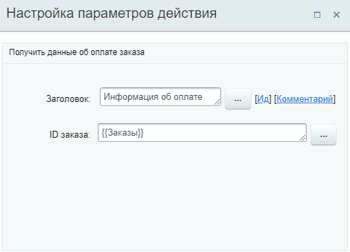

# Получить информацию об оплате

**Навигация**
- [← Оглавление курса](index.md)
- [← Предыдущий: 23568 — Получить информацию о товарной позиции](lesson_23568.md)
- [Следующий: 23586 — Получить информацию об элементе CRM →](lesson_23586.md)

Официальная страница урока: https://dev.1c-bitrix.ru/learning/course/index.php?COURSE_ID=57&LESSON_ID=23570

Действие позволяет получить данные о статусе оплаты заказа для передачи в другие действия.

**Примечание:** Действие доступно только в бизнес-процессах [Сделок](https://helpdesk.bitrix24.ru/open/5493461/) и [Счетов](https://helpdesk.bitrix24.ru/open/14795982/), и работает для **Заказов** (при включенном режиме

			работы с заказами

                    Подробнее на [helpdesk.bitrix24.ru](https://helpdesk.bitrix24.ru/open/13632830/).

		).

#### Описание параметров

- **ID заказа** – укажите идентификатор ID заказа, по которому нужно получить данные об оплате.

#### Пример настройки:

В параметре указан ID заказа

			текущей сделки

                    

		 (в которой запущен бизнес-процесс).

В результате в секции **Дополнительные результаты** формы Вставка значения станут доступны:

- ID оплаты;
- Номер оплаты.
