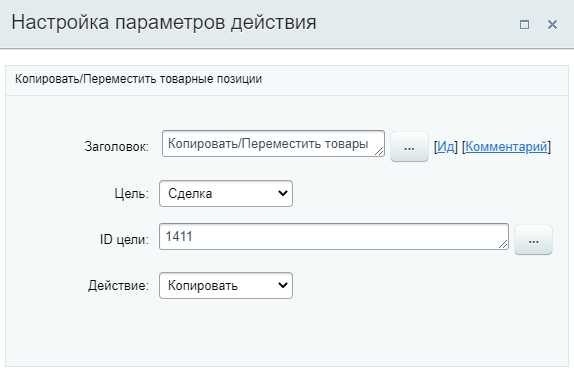

# Копировать или Переместить товарные позиции

**Навигация**
- [← Оглавление курса](index.md)
- [← Предыдущий: 23580 — Изменить элемент смарт-процесса](lesson_23580.md)
- [Следующий: 20862 — Копировать сделку →](lesson_20862.md)

Официальная страница урока: https://dev.1c-bitrix.ru/learning/course/index.php?COURSE_ID=57&LESSON_ID=23572

Действие копирует или переносит

			товарные позиции

                    В карточках лидов, сделок и предложений товары находятся в отдельной вкладке.

Подробнее на [helpdesk.bitrix24.ru](https://helpdesk.bitrix24.ru/open/13216242/)

		 из текущего элемента в указанный.

**Примечание:** Действие доступно в бизнес-процессах [Сделок](https://helpdesk.bitrix24.ru/open/5493461/), [Коммерческих предложений](https://helpdesk.bitrix24.ru/open/5450649/), [Счетов](https://helpdesk.bitrix24.ru/open/14795982/) и [Смарт-процессов](https://helpdesk.bitrix24.ru/open/13315798/).

#### Описание параметров

- **Цель** – выберите из списка тип сущности CRM;
- **ID цели** – укажите ID сущности, в которую будут скопированы/перемещены товарные позиции;
- **Действие** – выберите необходимое действие:

  - **Копировать** – товарные позиции будут скопированы в указанную сущность, т.е. сохранены в текущем документе (в котором запущен бизнес-процесс);
  - **Переместить** – товарные позиции будут перемещены в указанную сущность, т.е. удалены в текущем документе (в котором запущен бизнес-процесс).

#### Пример

В примере в качестве ID цели указан ID конкретной сделки. ID можно указать и через форму Вставка значения. Например, это может быть ID сделки созданной ранее действием

			Создание новой сделки

                    Действие аналогично действиям в публичной части CRM по созданию новой сделки.

[Подробнее](lesson_3775.md)...

		 (хранится в дополнительных результатах).
