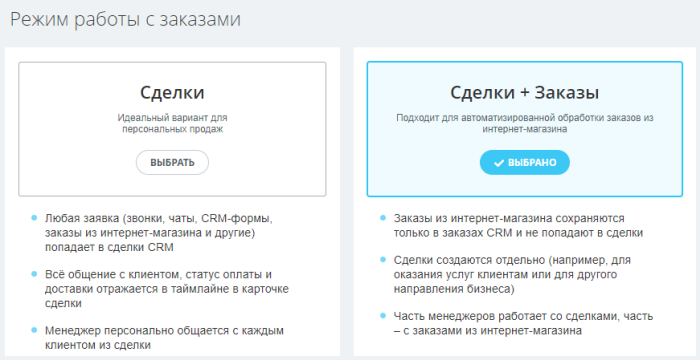
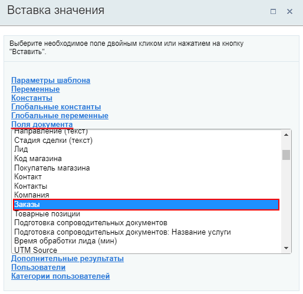
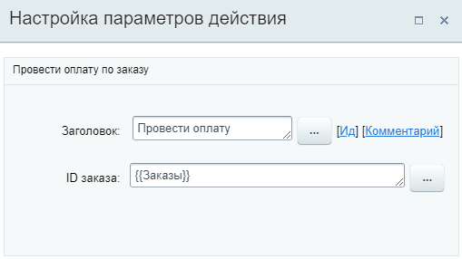

# Провести автоплатёж

**Навигация**
- [← Оглавление курса](index.md)
- [← Предыдущий: 20770 — Поставить паузу](lesson_20770.md)
- [Следующий: 20826 — Сменить воронку →](lesson_20826.md)

Официальная страница урока: https://dev.1c-bitrix.ru/learning/course/index.php?COURSE_ID=57&LESSON_ID=23574

**Внимание**! Сейчас рекуррентные платежи не работают. Настроить автоплатеж действием бизнес-процесса — не получится. Информация ниже актуальна для старых CRM-форм.

Действие позволяет автоматически списывать деньги с карты клиента, если при оплате был выбран автоплатеж. Работает с рекуррентыми оплатами. Доступно только в бизнес-процессах [Сделок](https://helpdesk.bitrix24.ru/open/5493461/) и [Счетов](https://helpdesk.bitrix24.ru/open/14795982/) для **Заказов** (при включенном режиме

			работы с заказами

                    Подробнее на [helpdesk.bitrix24.ru](https://helpdesk.bitrix24.ru/open/13632830/).

		).

#### Описание параметров

- **ID заказа** — укажите идентификатор ID заказа, по которому нужно провести оплату.

#### Пример настройки:

В параметре указан ID заказа

			текущей сделки

                    

		 (в которой запущен бизнес-процесс).

