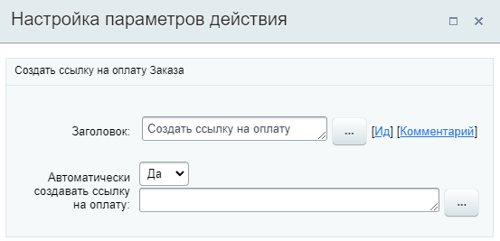
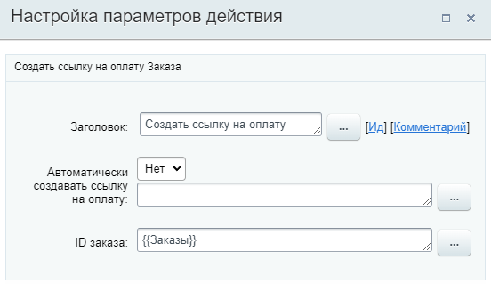

# Создать ссылку на оплату

**Навигация**
- [← Оглавление курса](index.md)
- [← Предыдущий: 20864 — Создать повторный Лид](lesson_20864.md)
- [Следующий: 23582 — Создать элемент CRM →](lesson_23582.md)

Официальная страница урока: https://dev.1c-bitrix.ru/learning/course/index.php?COURSE_ID=57&LESSON_ID=23576

Действие позволяет создать ссылку на оплату Заказа. Действие доступно в шаблонах бизнес-процессов [Сделок](https://helpdesk.bitrix24.ru/open/5493461/) и [Счетов](https://helpdesk.bitrix24.ru/open/14795982/).

#### Описание параметров

- **Автоматически создавать ссылку на оплату** – если **Да**, то для Сделки, в которой запущен бизнес-процесс, будет создана короткая ссылка на оплату;
- **ID заказа** – параметр доступен, если в первом параметре было указано **Нет**. Укажите идентификатор ID заказа, для которого нужно получить ссылку на оплату.

**Важно**! Действие работает с заказами. В настоящий момент заказ в сделке создается только при нажатии кнопки

			Принять оплату

                    CRM.Оплата и доставка - инструмент для принятия оплаты и оформления доставки в карточке сделки.

Подробнее на [helpdesk.bitrix24.ru](https://helpdesk.bitrix24.ru/open/11274792/)

		.

Если же у вас включен режим

			«Сделки + Заказы»

                    Подробнее на [helpdesk.bitrix24.ru](https://helpdesk.bitrix24.ru/open/13632830/).

		, то в действии можно указать ID нужного заказа.

Если вы уже работаете в режиме «Сделки», то вернуться в режим «Сделки + Заказы», не получится. Режим работы с заказами больше не поддерживается в Битрикс24.

В результате в секции **Дополнительные результаты** формы Вставка значения станет доступна **Ссылка**.

#### Примеры настройки:

Если в параметре **Автоматически создавать ссылку на оплату** указано **Да**, то второй параметр недоступен для заполнения:

Если в первом параметре указано **Нет**, то требуется указать ID заказа. Например, это может быть ID заказа

			текущей сделки

                    

		 (в которой запущен бизнес-процесс).

