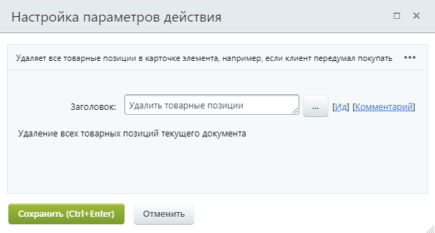

# Удалить товарные позиции

**Навигация**
- [← Оглавление курса](index.md)
- [← Предыдущий: 23582 — Создать элемент CRM](lesson_23582.md)
- [Следующий: 23584 — Удалить элемент CRM →](lesson_23584.md)

Официальная страница урока: https://dev.1c-bitrix.ru/learning/course/index.php?COURSE_ID=57&LESSON_ID=23578

Действие удаляет все

			товарные позиции

                    В карточках лидов, сделок и предложений товары находятся в отдельной вкладке.

Подробнее на [helpdesk.bitrix24.ru](https://helpdesk.bitrix24.ru/open/13216242/)

		 в карточке элемента, например, если клиент передумал покупать.

**Примечание:** Действие доступно в шаблонах бизнес-процессов [Сделок](https://helpdesk.bitrix24.ru/open/5493461/), [Коммерческих предложений](https://helpdesk.bitrix24.ru/open/5450649/), [Счетов](https://helpdesk.bitrix24.ru/open/14795982/) и [Смарт-процессов](https://helpdesk.bitrix24.ru/open/13315798/).

Параметров не имеет и действует для текущего документа, для которого запущен бизнес-процесс.

