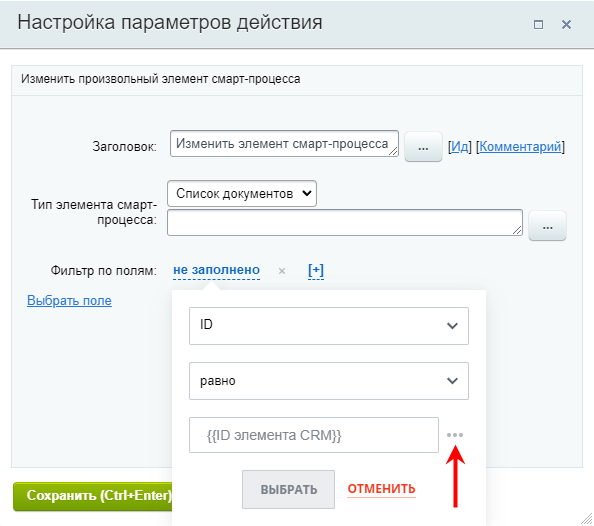
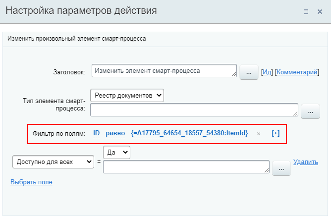

# Изменить элемент смарт-процесса

**Навигация**
- [← Оглавление курса](index.md)
- [← Предыдущий: 20860 — Изменить реквизиты](lesson_20860.md)
- [Следующий: 23572 — Копировать или Переместить товарные позиции →](lesson_23572.md)

Официальная страница урока: https://dev.1c-bitrix.ru/learning/course/index.php?COURSE_ID=57&LESSON_ID=23580

Действие позволяет изменить элемент произвольного смарт-процесса.

**Примечание.** О работе со смарт-процессами в Битрикс24 читайте в статье [helpdesk.bitrix24.ru](https://helpdesk.bitrix24.ru/open/13315798/)

#### Описание параметров

- **Тип элемента смарт-процесса** – выберите тип смарт-процесса из списка. В списке представлены созданные в системе смарт-процессы;
- **Фильтр по полям** – укажите поля и их значения, для выбора элемента, который требуется изменить. В фильтре доступна
  			подстановка значения
                      Для подстановки значения нажмите на три точки справа от поля ввода:
  
  		. Если по результатам настройки фильтра будут подходить несколько элементов, то изменения будут внесены только для первого найденного элемента (первого в списке по ID).
  Изменить информацию для нескольких элементов возможно с помощью
  			итератора
                      Конструкция выполняет перебор значений во множественных переменных. С помощью этой конструкции возможно создать цикл действий, каждая итерация которого выполнится с очередным значением множественной переменной (константы, параметра, поля документа).
  [Подробнее](lesson_10481.md)...
  		, если список этих элементов сохранен в множественной переменной / поле. В этом случае в фильтре нужно указать ID равным **Значению** итератора (из дополнительных результатов);
- **Выбрать поле** – по нажатии на ссылку добавляется строка с выборам поля. Выберите поле и укажите его новое значение. Доступно использование формы
  			Вставка значения
                      При работе с бизнес-процессом в параметрах действий, параметрах шаблона и настройках статуса есть возможность указывать как собственный текст (заданный вручную), так и использовать различные переменные значения (поля документа и прочие данные, которые могут меняться и поэтому не задаются вручную). Для подстановки таких переменных значений используется специальная форма **Вставка значения**.
  [Подробнее](lesson_12383.md)...
  		.

#### Пример настройки:

