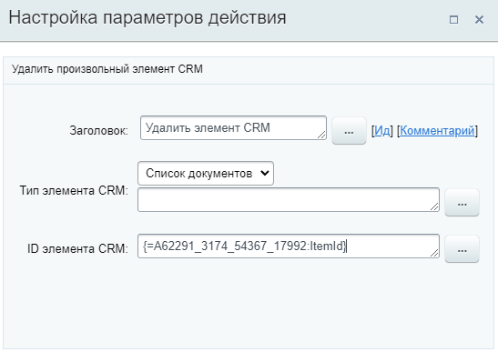
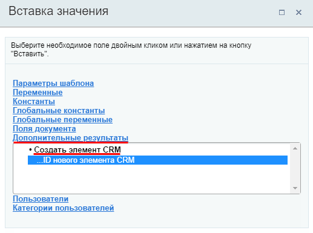

# Удалить элемент CRM

**Навигация**
- [← Оглавление курса](index.md)
- [← Предыдущий: 23578 — Удалить товарные позиции](lesson_23578.md)
- [Следующий: 7725 — Детально об объекте Диска →](lesson_7725.md)

Официальная страница урока: https://dev.1c-bitrix.ru/learning/course/index.php?COURSE_ID=57&LESSON_ID=23584

Действие удаляет элемент CRM, когда больше нет необходимости его хранить.

**Примечание**: До версии модуля CRM **21.1800.0** действие имело название Удалить элемент смарт-процесса и позволяло удалить только элемент смарт-процесса.
Если вы ранее уже использовали действие со старым названием в шаблоне БП, то шаблон продолжит исправно работать, а действие будет с пользовательским названием.

#### Описание параметров

- **Тип элемента CRM** – выберите тип элемента CRM из списка.  Доступны все типы элементов, кроме
  			старых счетов
                      В CRM есть две версии счетов: новая, которую мы выпустили в конце 2021 года, и старая, которой уже несколько лет. Основная разница в том, что новые счета сделаны на базе смарт-процессов.
  Подробнее на [helpdesk.bitrix24.ru](https://helpdesk.bitrix24.ru/open/15463018/).
  		:

  - [Контакт](https://helpdesk.bitrix24.ru/open/5491741/)
- [Компания](https://helpdesk.bitrix24.ru/open/5493389/)
- [Лид](https://helpdesk.bitrix24.ru/open/1357950/)
- [Сделка](https://helpdesk.bitrix24.ru/open/5493461/)
- [Предложение](https://helpdesk.bitrix24.ru/open/5450649/)
- [Счет](https://helpdesk.bitrix24.ru/open/14795982/)
- [Смарт-процесс](https://helpdesk.bitrix24.ru/open/13315798/) (каждый смарт-процесс представлен отдельной строкой в списке)

**ID элемента CRM** – укажите идентификатор ID элемента CRM вручную или с помощью формы

			«Вставка значения»

                    При работе с бизнес-процессом в параметрах действий, параметрах шаблона и настройках статуса есть возможность указывать как собственный текст (заданный вручную), так и использовать различные переменные значения (поля документа и прочие данные, которые могут меняться и поэтому не задаются вручную). Для подстановки таких переменных значений используется специальная форма **Вставка значения**.

[Подробнее](lesson_12383.md)...

		.

#### Пример настройки:

В примере выбран идентификатор элемента смарт-процесса, созданного ранее в шаблоне действием

			Создать элемент CRM

                    

[Подробнее...](lesson_23582.md)

		.
