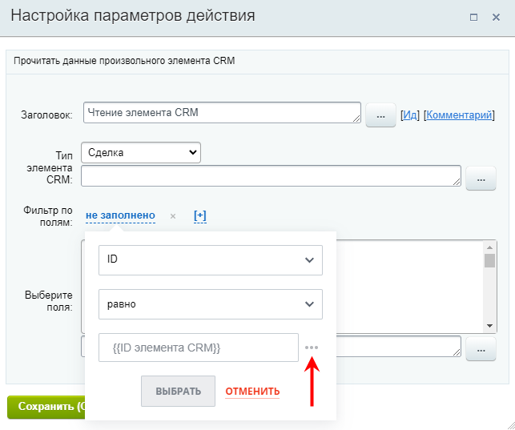
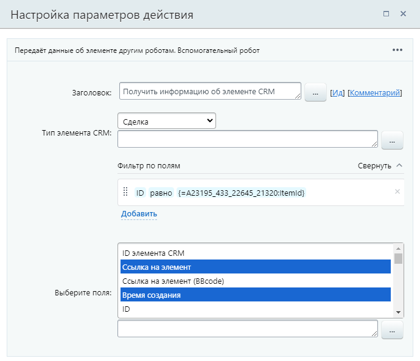
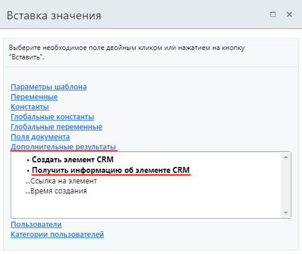

# Получить информацию об элементе CRM

**Навигация**
- [← Оглавление курса](index.md)
- [← Предыдущий: 23570 — Получить информацию об оплате](lesson_23570.md)
- [Следующий: 28606 — Пригласить клиента в мессенджер →](lesson_28606.md)

Официальная страница урока: https://dev.1c-bitrix.ru/learning/course/index.php?COURSE_ID=57&LESSON_ID=23586

Действие передаёт данные об элементе другим действиям.

**Примечание**: До версии модуля CRM **21.1800.0** действие имело название Чтение элемента смарт-процесса и позволяло прочитать данные только элемента смарт-процесса.
Если вы ранее уже использовали действие со старым названием в шаблоне БП, то шаблон продолжит исправно работать, а действие будет с пользовательским названием.

#### Описание параметров

- **Тип элемента CRM** – выберите тип элемента CRM из списка. Доступны все типы элементов, кроме
  			старых счетов
                      В CRM есть две версии счетов: новая, которую мы выпустили в конце 2021 года, и старая, которой уже несколько лет. Основная разница в том, что новые счета сделаны на базе смарт-процессов.
  Подробнее на [helpdesk.bitrix24.ru](https://helpdesk.bitrix24.ru/open/15463018/).
  		:

  - [Контакт](https://helpdesk.bitrix24.ru/open/5491741/)
- [Компания](https://helpdesk.bitrix24.ru/open/5493389/)
- [Лид](https://helpdesk.bitrix24.ru/open/1357950/)
- [Сделка](https://helpdesk.bitrix24.ru/open/5493461/)
- [Предложение](https://helpdesk.bitrix24.ru/open/5450649/)
- [Счет](https://helpdesk.bitrix24.ru/open/14795982/)
- [Смарт-процесс](https://helpdesk.bitrix24.ru/open/13315798/) (*каждый смарт-процесс представлен отдельной строкой в списке*)
  **Примечание**: Для получения информации по смарт-процессу в [настройках этого смарт-процесса](https://helpdesk.bitrix24.ru/open/13315798/) должны быть включены опции:
  - Использовать в смарт-процессе роботы и триггеры;
  - Использовать в смарт-процессе дизайнер бизнес-процессов.
  Иначе действие вернёт пустые значения полей.

**Фильтр по полям** – укажите поля и их значения для отбора элемента, данные которого требуется прочитать. В фильтре доступна

			подстановка значения

                    Для подстановки значения нажмите на три точки справа от поля ввода:

		. Если по фильтру находится несколько элементов:

- система сначала проверяет воронки и выбирает ту, у которой выше приоритет
- затем из этой воронки берет элемент с наименьшим ID

Если элементы в одной воронке, бизнес-процесс просто выберет элемент с наименьшим ID.

Прочитать информацию для нескольких элементов возможно с помощью

			итератора

                    Конструкция выполняет перебор значений во множественных переменных. С помощью этой конструкции возможно создать цикл действий, каждая итерация которого выполнится с очередным значением множественной переменной (константы, параметра, поля документа).

[Подробнее](lesson_10481.md)...

		, если список этих элементов сохранен в множественной переменной / поле. В этом случае в фильтре нужно указать ID равным **Значению** итератора (из дополнительных результатов)

**Выберите поля** – выберите поля элемента CRM, значения которых необходимо получить. Набор доступных полей зависит от типа элемента. Для выбора нескольких полей зажмите клавишу **Ctrl** на клавиатуре.

#### Пример настройки:

Выбранные значения полей станут доступны в секции **Дополнительные результаты** формы «Вставка значения».

