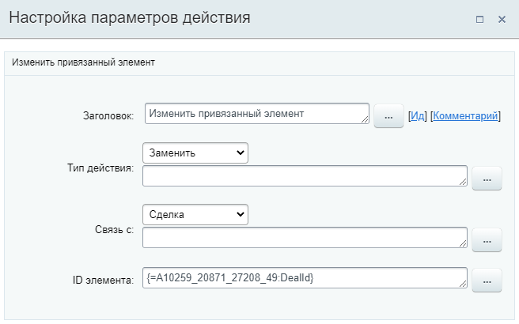

# Изменить привязанный элемент

**Навигация**
- [← Оглавление курса](index.md)
- [← Предыдущий: 8539 — Изменить ответственного](lesson_8539.md)
- [Следующий: 20860 — Изменить реквизиты →](lesson_20860.md)

Официальная страница урока: https://dev.1c-bitrix.ru/learning/course/index.php?COURSE_ID=57&LESSON_ID=23590

Действие позволяет изменить привязанный элемент CRM.

**Внимание**! Доступно только в шаблонах бизнес-процессов **Смарт-процессов**.

#### Описание параметров

- **Тип действия** – выберите какое действие совершить с элементом: **Удалить** или **Заменить**;
- **Связь с** – выберите сущность CRM, которую нужно изменить. Список зависит от настроек смарт-процесса, а именно какие
  			элементы CRM
                      
  		 могут быть привязаны к смарт-процессам;
- **ID элемента** – укажите вручную или с помощью формы Вставка значения идентификатор ID элемента:

  - Если выбран тип действия **Заменить**, в параметре указывается ID элемента, который нужно привязать к элементу смарт-процесса;
  - Если выбран тип действия **Удалить**, параметр можно оставить пустым. В результате выполнения действия будет просто удалена существующая привязка.

#### Пример

В примере в качестве ID элемента указан ID сделки, созданной ранее действием

			Создание новой сделки

                    Действие аналогично действиям в публичной части CRM по созданию новой сделки.

[Подробнее](lesson_3775.md)...

		, с помощью формы

			Вставка значения

                    ID созданной сделки хранится в дополнительных результатах.

		.
