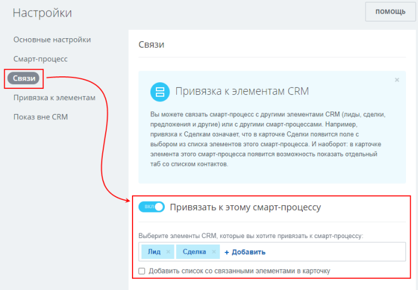
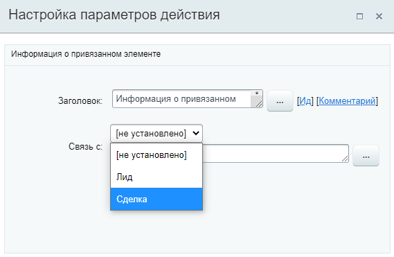
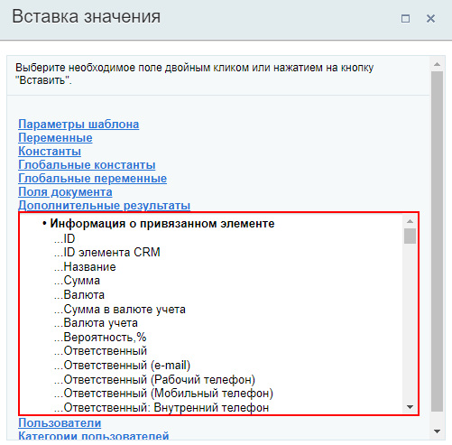

# Получить информацию о привязанном элементе

**Навигация**
- [← Оглавление курса](index.md)
- [← Предыдущий: 8529 — Отправить письмо клиенту](lesson_8529.md)
- [Следующий: 20858 — Получить информацию о реквизитах →](lesson_20858.md)

Официальная страница урока: https://dev.1c-bitrix.ru/learning/course/index.php?COURSE_ID=57&LESSON_ID=23592

Действие получает значения полей в привязанном элементе для передачи в другие действия.

**Внимание!** Доступно только в бизнес-процессах **смарт-процессов**. О работе со смарт-процессами в Битрикс24 читайте в статье [helpdesk.bitrix24.ru](https://helpdesk.bitrix24.ru/open/13315798/)

#### Описание параметров

- **Связь с** – выберите сущность CRM, по которой нужно получить информацию. Список зависит от настроек смарт-процесса, а именно какие
  			элементы CRM
                      
  		 могут быть привязаны к смарт-процессам.
  

Все поля выбранной сущности станут доступны в секции **Дополнительные результаты** формы

			«Вставка значения»

                    При работе с бизнес-процессом в параметрах действий, параметрах шаблона и настройках статуса есть возможность указывать как собственный текст (заданный вручную), так и использовать различные переменные значения (поля документа и прочие данные, которые могут меняться и поэтому не задаются вручную). Для подстановки таких переменных значений используется специальная форма **Вставка значения**.

[Подробнее](lesson_12383.md)...

		.

